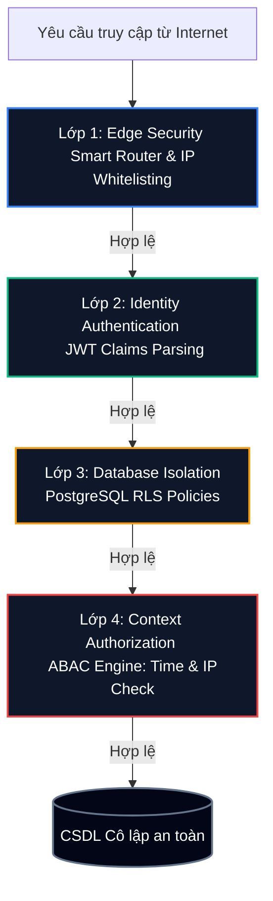
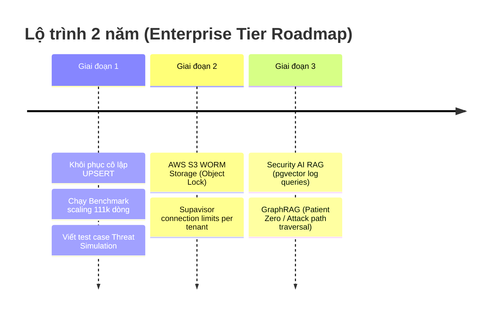

# Secure Multi-tenant SaaS Platform (Sacred Spaces / Non-profit Architecture)

[](https://nextjs.org)
[](https://supabase.com)
[](https://www.typescriptlang.org)
[](#2-kien-truc-phong-thu-chieu-sau-defense-in-depth)
[](#1-luan-diem-khoa-hoc-trung-tam-thesis-scientific-foundation)

> **Mã nguồn thực nghiệm chính thức phục vụ Đồ án Tốt nghiệp**  
> *   **Đề tài:** Nghiên cứu và thiết kế kiến trúc phần mềm an toàn cho nền tảng đa khách hàng (Secure Multi-tenant SaaS): Áp dụng Row-Level Security và Audit Log trong quản trị rủi ro thông tin.  
> *   **Học viện:** Học viện Công nghệ Bưu chính Viễn thông (PTIT) | **Khoa:** Công nghệ Thông tin  
> *   **Học viên:** Chăm Rốch Thi | **Năm bảo vệ:** 2026

---

## 1. Luận điểm khoa học trung tâm (Thesis Scientific Foundation)

Trọng tâm nghiên cứu của đề tài tập trung giải quyết bài toán tối ưu hóa hạ tầng và an toàn thông tin mức doanh nghiệp (Research Engineer Mindset):

> **"Đề tài chứng minh rằng kiến trúc RLS kết hợp JWT Custom Claims đạt độ phức tạp trích xuất phân quyền tối ưu O(1) (in-memory JWT resolution) và cơ chế lọc mức dòng đạt O(log N_tenant) tối ưu chỉ mục (Indexed B-Tree Scan) — dưới điều kiện tấn công thực tế — và đo lường được chi phí bảo mật (cost of security) ở từng lớp của kiến trúc Phòng thủ Chiều sâu (Defense-in-depth)."**

---

## 2. Kiến trúc Phòng thủ Chiều sâu (Defense-in-depth)

Hệ thống được thiết kế theo triết lý **Zero Trust Architecture (ZTA)** gồm 4 lớp bảo vệ hình phễu, giảm thiểu các nguy cơ rò rỉ dữ liệu chéo giữa các tenant (cross-tenant) và leo thang đặc quyền:



### Chi tiết cơ chế hoạt động của từng lớp:
1.  **Lớp 1: Edge Security (Smart Router & Intranet Lockdown)**
    *   *Mã nguồn:* [middleware.ts](file:///e:/PTIT_THESIS_SAAS/middleware.ts)
    *   *Cơ chế:* Next.js Middleware thực thi tại Edge Runtime (<4ms) phân tích host/subdomain từ header để định tuyến động (`Smart Router`). Đồng thời truy vấn động danh sách IP an toàn của Tenant từ cơ sở dữ liệu (được cache 30s) để thực thi khóa mạng nội bộ (`Intranet Lockdown`), chặn IP lạ truy cập phân khu quản trị.
2.  **Lớp 2: Identity Authentication (Xác thực danh tính trong bộ nhớ)**
    *   *Mã nguồn:* Supabase Auth & JWT Custom Claims
    *   *Cơ chế:* Thông tin ID khách hàng (`tenant_id`) và vai trò phân quyền (`role`) được nhúng trực tiếp và ký số mật mã học vào JWT payload khi đăng nhập. RLS Engine trích xuất trực tiếp thông tin này từ bộ nhớ RAM của Postgres Session (`auth.jwt()`) giúp đạt tốc độ xử lý **O(1)**, bypass hoàn toàn các phép `JOIN` bảng quyền hạn tốn kém.
3.  **Lớp 3: Database Isolation (Cô lập cấp CSDL)**
    *   *Mã nguồn:* Các chính sách RLS trên tất cả các bảng nghiệp vụ.
    *   *Cơ chế:* Thực thi an toàn cứng ở tầng cơ sở dữ liệu. Mọi truy vấn từ ứng dụng đều bị PostgreSQL tự động viết lại (Query Rewrite), áp dụng bộ lọc cứng: `tenant_id = (auth.jwt()->>'tenant_id')::uuid`, đảm bảo cô lập dữ liệu chéo tuyệt đối.
4.  **Lớp 4: Context Authorization (ABAC Dynamic Attributes)**
    *   *Mã nguồn:* [20260516100000_abac_time_ip_policies.sql](file:///e:/PTIT_THESIS_SAAS/supabase/migrations/20260516100000_abac_time_ip_policies.sql)
    *   *Cơ chế:* Các hàm PL/pgSQL kiểm tra các điều kiện động như giờ hành chính (`is_within_business_hours()`) và IP truy cập ngữ cảnh trên các bảng tin tức, sự kiện, ngân quỹ, ngăn chặn hành vi lạm quyền ngoài giờ.

---

## 3. Các Trụ cột Kỹ thuật Cốt lõi (Core Technical Pillars)

### 3.1 Sổ cái kiểm toán bất biến Cryptographic WORM Vault (Write Once, Read Many)
*   *Mã nguồn:* [worm-vault.ts](file:///e:/PTIT_THESIS_SAAS/lib/security/worm-vault.ts) & Trigger DB
*   **Bất biến vật lý cấp DB:** Kích hoạt trigger PostgreSQL chặn hoàn toàn lệnh UPDATE/DELETE trên bảng audit_logs từ mọi tài khoản, kể cả Super Admin (tuân thủ tiêu chuẩn ISO/IEC 27017 CLD.12.4.1).
*   **Bảo vệ mật mã học (SHA-256 Hash-chaining):** Xây dựng module tự động tính toán băm mật mã học liên kết chuỗi khối cho toàn bộ dòng log:
    Hash_current = SHA256(Record_Content + Hash_previous)
    Ledger này được đồng bộ bất biến vào private bucket security-vault trên cloud storage (hoặc local fallback với thuộc tính file read-only 0o444). Nếu dữ liệu thô trong database bị can thiệp trái phép, chuỗi liên kết sẽ bị gãy và kích hoạt báo động giả mạo vật lý lập tức.

### 3.2 Động cơ SOAR & Phòng vệ chủ động (Active Defense)
*   *Mã nguồn:* [20260522000002_dynamic_telegram_alerts_and_auto_suspend.sql](file:///e:/PTIT_THESIS_SAAS/supabase/migrations/20260522000002_dynamic_telegram_alerts_and_auto_suspend.sql)
*   **Tự động cô lập Anomaly (Auto-suspension):** Database trigger đếm tần suất vi phạm an ninh (RLS Violation) của từng Tenant. Nếu phát hiện hành vi tấn công dồn dập (3 vi phạm/phút), hệ thống tự động khóa chuyển trạng thái tenant sang suspended, chặn đứng mọi truy cập ghi vào hệ thống.
*   **Telegram Webhook Alert bất đồng bộ:** Sử dụng hàm net.http_post của PostgreSQL bắn webhook trực tiếp về Telegram cá nhân của Admin thời gian thực. Tích hợp phép ghép chuỗi CHR(10) trong SQL để định dạng tin nhắn phân dòng rõ ràng, sắc nét và chuyên nghiệp trên thiết bị di động của quản trị viên.

### 3.3 Phân hệ Thực nghiệm Đo lường hiệu năng (Performance Benchmarking)
*   *Mã nguồn:* [scaling-engine.ts](file:///e:/PTIT_THESIS_SAAS/app/admin/performance/scaling-engine.ts) & [page.tsx](file:///e:/PTIT_THESIS_SAAS/app/admin/performance/page.tsx)
*   **Dataset quy mô lớn:** Đo đạc thực tế độ trễ của **111,000 bản ghi dữ liệu thật** trên Supabase Cloud.
*   **Kết quả đo đạc trực quan:** So sánh 3 baseline lọc dữ liệu dưới cả 2 trạng thái **Hot Read** (Warm Cache - Shared Buffers Hit) và **Cold Read** (SSD I/O):
    *   *App-side Filtering:* Lọc ở tầng ứng dụng. Khi dữ liệu phình to lên 100,000 dòng, thời gian xử lý và độ trễ tăng vọt dốc ngược theo độ phức tạp O(N) do tốn tài nguyên truyền tải (Network I/O) và bộ nhớ RAM.
    *   *RLS JOIN:* Dùng RLS JOIN bảng kiểm tra quyền truyền thống. Độ trễ tăng theo quy mô do chi phí JOIN phức tạp.
    *   *Optimized RLS (Claims):* Đọc tenant_id từ JWT Claims trong RAM Session (O(1)) kết hợp B-Tree Index. Độ trễ duy trì sự ổn định tuyệt vời (gần như flat từ 1.1 ms đến 3.5 ms ở quy mô 100,000 dòng) nhờ độ phức tạp **O(log N_tenant)** (Indexed B-Tree Scan).
*   **EXPLAIN (ANALYZE, BUFFERS):** Bóc tách chi tiết cây thực thi truy vấn của PostgreSQL để chứng minh RLS chèn claims RAM và tận dụng Index Scan thay vì Sequential Scan.

### 3.4 Phân hệ Trợ lý AI Dharma Chat & Agentic GraphRAG (Phụ trợ NCKH)
*   *Mã nguồn:* Thư mục [docs/ai-rag/](file:///e:/PTIT_THESIS_SAAS/docs/ai-rag) & Migration AI Copilot
*   **RAG (Retrieval Augmented Generation):** Truy vấn tri thức sâu dựa trên kho tài liệu kinh điển PDF/Text (Kinh - Luật - Luận) Phật giáo Nguyên thủy, trích xuất dẫn chứng chính xác và phản hồi tiếng Việt có dẫn nguồn trực quan.
*   **Neural Conversational Memory:** Ghi nhớ 10 tin nhắn gần nhất và giải mã ngữ cảnh câu hỏi nối tiếp của người dùng.
*   **GraphRAG (Knowledge Graph RAG):** Xây dựng Đồ thị Tri thức An ninh (Security Knowledge Graph) từ logs để tự động truy vết điểm xâm nhập ban đầu (Patient Zero) và phát hiện các chuỗi tấn công tinh vi (Credential Stuffing xuyên tenant).

---

## 4. Bản ánh xạ đề cương & Mã nguồn thực tế (Proposal-to-Code Matrix)

| Mục tiêu học thuật (Proposal Requirement) | Cơ chế thực thi (Implementation Mechanism) | File mã nguồn & Migration tương ứng |
| :--- | :--- | :--- |
| **Smart Router & Edge Resolution** | Next.js Edge Routing (<4ms) | [middleware.ts](file:///e:/PTIT_THESIS_SAAS/middleware.ts) |
| **Intranet Lockdown IP Whitelisting** | DB-aware IP check dynamic at Edge | [middleware.ts](file:///e:/PTIT_THESIS_SAAS/middleware.ts) |
| **RBAC Authorization Model** | 6 vai trò chính doanh nghiệp | [lib/permissions.ts](file:///e:/PTIT_THESIS_SAAS/lib/permissions.ts) |
| **ABAC Authorization Model** | Time-based and IP Whitelist constraints | [20260516100000_abac_time_ip_policies.sql](file:///e:/PTIT_THESIS_SAAS/supabase/migrations/20260516100000_abac_time_ip_policies.sql) |
| **Immutable Audit Log System** | PostgreSQL trigger block UPDATE/DELETE | [20260522000001_immutable_audit_logs.sql](file:///e:/PTIT_THESIS_SAAS/supabase/migrations/20260522000001_immutable_audit_logs_and_abac_extension.sql) |
| **Cryptographic Ledger WORM Vault** | SHA-256 Hash-chaining and sync engine | [worm-vault.ts](file:///e:/PTIT_THESIS_SAAS/lib/security/worm-vault.ts) |
| **Cyber SOC Dashboard** | Security Score, RLS %, Anomaly Timeline | [page.tsx (security-center)](file:///e:/PTIT_THESIS_SAAS/app/admin/security-center/page.tsx) |
| **Active Alerting (SOAR Engine)** | Auto-suspension & Webhook Telegram Bot | [20260522000002_dynamic_telegram_alerts_and_auto_suspend.sql](file:///e:/PTIT_THESIS_SAAS/supabase/migrations/20260522000002_dynamic_telegram_alerts_and_auto_suspend.sql) |
| **Tenant Hard Wipe & Offboarding** | Cascade dọn dẹp và phân mảnh DB | [20260517000001_tenant_offboarding_runbook.sql](file:///e:/PTIT_THESIS_SAAS/supabase/migrations/20260517000001_tenant_offboarding_runbook.sql) |
| **RLS Performance Benchmarking** | Logarithmic O(log N) Scaling Chart | [page.tsx (performance)](file:///e:/PTIT_THESIS_SAAS/app/admin/performance/page.tsx) |
| **Threat Simulator Panel** | Giả lập 4 kịch bản, EXPLAIN, Why Blocked | [page.tsx (threat-simulator)](file:///e:/PTIT_THESIS_SAAS/app/admin/threat-simulator/page.tsx) |

---

## 5. Cài đặt và Chạy local (Installation & Quick Start)

### 5.1 Yêu cầu hệ thống (Prerequisites)
*   Node.js >= 20.x | npm >= 10.x
*   PostgreSQL 16.x hoặc tài khoản Supabase Cloud hoạt động.

### 5.2 Cài đặt & Khởi chạy nhanh
```bash
# 1. Clone project và cài đặt package
npm install

# 2. Sao chép và cấu hình biến môi trường
cp .env.example .env.local

# 3. Khởi chạy môi trường local (mặc định hỗ trợ Next.js Turbopack)
npm run dev
```

### 5.3 Danh mục Biến môi trường quan trọng (`.env.local`)
```env
# Supabase Cloud Project Credentials
NEXT_PUBLIC_SUPABASE_URL=https://your-project-id.supabase.co
NEXT_PUBLIC_SUPABASE_ANON_KEY=eyJhbGciOiJIUzI1NiIsInR5cCI6IkpXVCJ9...
SUPABASE_SERVICE_ROLE_KEY=eyJhbGciOiJIUzI1NiIsInR5cCI6IkpXVCJ9... # Cần cho bypass RLS đo benchmark

# Security Webhook Alerts (SOAR Telegram Bot)
TELEGRAM_BOT_TOKEN=123456789:ABCdefGhIJKlmNoPQRsTUVwxyZ
TELEGRAM_CHAT_ID=987654321

# Core Secrets
REVALIDATE_SECRET=your_hmac_secret_for_cache_invalidation
CRON_SECRET=your_cron_execution_guard_token
```

### 5.4 Seed dữ liệu thực nghiệm 111,000 bản ghi
Để kích hoạt đầy đủ 111,000 bản ghi dữ liệu seed thực tế cho trang Benchmarking và chạy đo lường:
```bash
# Chạy script seed dữ liệu phân kỳ benchmark
npm run seed:all
```
Hoặc truy cập Supabase SQL Editor và chạy trực tiếp migration tạo dữ liệu:
[20260522000000_create_benchmark_rpcs.sql](file:///e:/PTIT_THESIS_SAAS/supabase/migrations/20260522000000_create_benchmark_rpcs.sql).

### 5.5 Disaster Recovery: Khôi phục cô lập tránh Rollback chéo
Để khôi phục dữ liệu của Tenant A mà không gây mất mát dữ liệu hoặc rollback chéo sang Tenant B, hệ thống xuất dữ liệu dạng JSON snapshot và sử dụng cơ chế **UPSERT cô lập** theo khóa chính thay vì khôi phục thô toàn bộ cơ sở dữ liệu:
```typescript
// Thực thi khôi phục cô lập cấp Tenant
const { error } = await supabase
  .from('news')
  .upsert(snapshotPayload.news.map((row) => ({ ...row, tenant_id: targetTenantId })));
```

---

## 6. Ma trận tuân thủ tiêu chuẩn an toàn đám mây ISO/IEC 27017

Hệ thống được đối chiếu trực tiếp và đáp ứng các điều khoản kiểm soát bảo mật đám mây:

### CLD.6.3.1 (Virtualization security isolation)
*   *Mục tiêu:* Cô lập tài nguyên ảo và dữ liệu giữa các khách hàng đám mây.
*   *Thực thi trong mã nguồn:* Sử dụng chính sách Row-Level Security (RLS) của PostgreSQL làm lớp cô lập ảo an toàn ở tầng cơ sở dữ liệu dùng chung.

### CLD.9.5.1 (Customer data deletion)
*   *Mục tiêu:* Đảm bảo dữ liệu khách hàng được dọn sạch hoàn toàn khi chấm dứt dịch vụ.
*   *Thực thi trong mã nguồn:* Tích hợp quy trình Hard Wipe CASCADE tự động xóa sạch dữ liệu các bảng con liên quan đến `tenant_id` tại file [20260517000001_tenant_offboarding_runbook.sql](file:///e:/PTIT_THESIS_SAAS/supabase/migrations/20260517000001_tenant_offboarding_runbook.sql).

### CLD.12.4.1 (Audit logging)
*   *Mục tiêu:* Nhật ký vận hành đám mây phải được ghi nhận và bảo vệ chống can thiệp.
*   *Thực thi trong mã nguồn:* Thiết lập bảng `audit_logs` bất biến bằng database trigger chặn lệnh sửa/xóa và đồng bộ băm chuỗi SHA-256 mật mã học sang WORM Ledger độc lập.

---

## 7. Lộ trình nâng cấp Kiến trúc 2 năm (Enterprise Tier Roadmap)

Đồ án vạch rõ 3 hướng nâng cấp và tối ưu hóa hệ thống phục vụ môi trường doanh nghiệp lớn:



1.  **Giai đoạn 1: Củng cố & Thực nghiệm (Hiện tại - v1.4.0):** Hoàn tất benchmark scaling 111,000 dòng, hoàn thiện các API UPSERT khôi phục cô lập, và hoàn chỉnh 4 test case kịch bản Threat Simulation.
2.  **Giai đoạn 2: Gia cố Hạ tầng Enterprise (Năm 2 - H1):** Tách biệt vật lý Audit Logs ra ngoài DB bằng cách forward sang AWS S3 WORM Storage có bật Object Lock. Thiết lập cấu hình connection pooling giới hạn slot kết nối tối đa cho mỗi tenant trên Supavisor để chống nghẽn chéo hoàn toàn.
3.  **Giai đoạn 3: Trí tuệ nhân tạo An ninh (Năm 2 - H2):** Triển khai AI RAG truy vấn log an ninh bằng ngôn ngữ tự nhiên và GraphRAG (Knowledge Graph RAG) để nhận diện Attack Path khi xảy ra sự cố bảo mật.

---

> [!IMPORTANT]  
> **TÀI LIỆU KHẢO SÁT & BẢO VỆ ĐỒ ÁN PTIT:**  
> Toàn bộ các file tài liệu canonical hỗ trợ ôn tập lý thuyết, ma trận đánh đổi hiệu năng (Pareto), và cẩm nang kịch bản phản biện trước Hội đồng PTIT được lưu trữ chi tiết tại thư mục [docs/](file:///e:/PTIT_THESIS_SAAS/docs). Hãy đọc kỹ tài liệu [docs/ACADEMIC_DEFENSE_BLUEPRINT.md](file:///e:/PTIT_THESIS_SAAS/docs/ACADEMIC_DEFENSE_BLUEPRINT.md) trước khi bước vào phòng bảo vệ.
