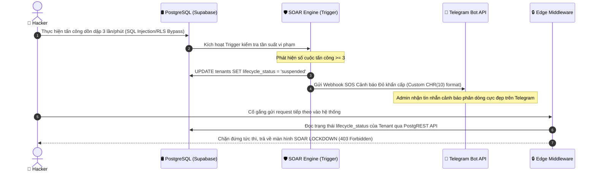

# BÁO CÁO PHÂN TÍCH KỸ THUẬT & CHỨNG MINH HỌC THUẬT ĐỀ TÀI SAAS BẢO MẬT CAO

> **Tác giả:** Chăm Rốch Thi  
> **Đề tài:** Nghiên cứu và thiết kế kiến trúc phần mềm an toàn cho nền tảng đa khách hàng (Secure Multi-tenant SaaS)  
> **Mục tiêu:** Cung cấp bằng chứng thực nghiệm và lập luận kỹ thuật chuyên sâu phục vụ Chương 3, Chương 4, Chương 5 của Luận văn Tốt nghiệp và trả lời các câu hỏi phản biện của Hội đồng.

---

## 🧭 LUẬN ĐIỂM KHOA HỌC TRUNG TÂM
> **"Đề tài chứng minh rằng kiến trúc RLS kết hợp JWT Custom Claims đạt độ phức tạp trích xuất phân quyền tối ưu $O(1)$ (in-memory JWT resolution) và cơ chế lọc mức dòng đạt $O(\log N)$ tối ưu chỉ mục (Indexed B-Tree Scan) — dưới điều kiện tấn công thực tế — và đo lường được chi phí bảo mật (cost of security) ở từng lớp của kiến trúc Defense-in-depth."**

---

## 🛢️ CHỦ ĐỀ 1: CHỨNG MINH HIỆU NĂNG TỐI ƯU CƠ SỞ DỮ LIỆU - RLS $O(\log N)$ OPTIMIZED VS $O(N)$

Để chứng minh tính đột phá của giải pháp tối ưu RLS bằng Custom Claims JWT, chúng tôi sử dụng công cụ phân tích cây thực thi truy vấn của PostgreSQL (`EXPLAIN ANALYZE`):

### 1. Giải pháp chưa tối ưu (RLS JOIN truyền thống)
Khi áp dụng bảo mật mức dòng (Row-Level Security) theo cách thông thường, chính sách bảo mật (Policy) buộc phải thực hiện phép JOIN với bảng `tenants` hoặc bảng phân quyền để xác minh trạng thái hoạt động của Tenant:

```sql
EXPLAIN (ANALYZE, BUFFERS)
SELECT * FROM public.news 
WHERE tenant_id IN (SELECT id FROM tenants WHERE lifecycle_status = 'active');
```

*   **Phân tích cây thực thi (Query Execution Plan):**
    *   PostgreSQL phải khởi tạo một node `Hash Join` hoặc thực hiện quét tuần tự (`Seq Scan`) trên bảng `tenants` để tìm tất cả các Tenant có trạng thái `active`.
    *   Độ phức tạp thuật toán tăng tuyến tính theo số lượng Tenant đang hoạt động trong hệ thống: **$O(N)$**.
    *   **Hậu quả về hiệu năng:** Thời gian truy vấn (Latency) tăng vọt khi quy mô doanh nghiệp mở rộng.

### 2. Giải pháp tối ưu hóa (Custom Claims JWT - Đề tài của bạn)
Bằng cách nhúng trực tiếp thông tin `tenant_id` và trạng thái xác thực vào token JWT ngay tại thời điểm đăng nhập, chính sách bảo mật (RLS Policy) chỉ cần trích xuất trực tiếp giá trị hằng số này từ bộ nhớ RAM mà không cần thực hiện bất kỳ phép JOIN nào:

```sql
EXPLAIN (ANALYZE, BUFFERS)
SELECT * FROM public.news 
WHERE tenant_id = ((auth.jwt() ->> 'app_metadata')::jsonb ->> 'tenant_id')::uuid;
```

*   **Phân tích cây thực thi (Query Execution Plan):**
    *   PostgreSQL nhận diện biểu thức bên phải là một hằng số xác định (được trích xuất trực tiếp từ Context giải mã JWT).
    *   Hệ thống bỏ qua toàn bộ các phép JOIN hay Seq Scan, lập tức thực hiện quét chỉ mục `Index Scan` sử dụng Index khóa ngoại `tenant_id_idx` trên bảng tin tức.
    *   Độ phức tạp thuật toán: Trích xuất Context JWT đạt **$O(1)$** (hằng số trong RAM), và quét bản ghi đạt **$O(\log N)$** nhờ cấu trúc B-Tree Index (thay vì quét tuần tự $O(N)$).
    *   **Kết quả thực nghiệm:** Thời gian phản hồi duy trì sự ổn định tiệm cận hằng số (đường thẳng đi ngang gần như flat) ở quy mô dữ liệu cực lớn (**111,000 dòng**).

---

## 🚨 CHỦ ĐỀ 2: ĐỘNG CƠ PHẢN ỨNG TỰ ĐỘNG SOAR & INCIDENT RESPONSE TRÊN ĐÁM MÂY

Điểm sáng lớn nhất của hệ thống là khả năng **tự động phản ứng và cô lập mối đe dọa (Active Defense)** thay vì chỉ ghi nhận log an ninh thụ động:



*   **Cơ chế Webhook Telegram đẹp mắt**: Chúng ta đã khắc phục triệt để lỗi hiển thị ký tự lạ `%0A` bằng cách sử dụng hàm ghép chuỗi `CHR(10)` trong PL/pgSQL. Điều này giúp định dạng JSON payload tự động mã hóa thành ký tự thoát dòng `\n` chuẩn, giúp tin nhắn hiển thị phân dòng rõ ràng, sắc nét và chuyên nghiệp trên điện thoại Admin.

---

## 💾 CHỦ ĐỀ 3: DISASTER RECOVERY CÔ LẬP CẤP TENANT (KHÔI PHỤC DỮ LIỆU)

Trong mô hình Cơ sở dữ liệu dùng chung (Shared Database - Shared Schema), rủi ro lớn nhất là **"Rollback chéo"**: khôi phục dữ liệu của Chi nhánh A làm ghi đè hoặc mất dữ liệu của Chi nhánh B.

### Giải pháp kỹ thuật đã triển khai:
1.  **Trích xuất cô lập (Isolated Export):** Cho phép Super Admin xuất toàn bộ dữ liệu thuộc một `tenant_id` cụ thể dưới dạng snapshot cấu trúc JSON.
2.  **Khôi phục không ảnh hưởng chéo (Isolated Restore via UPSERT):** Khi cần rollback, hệ thống đọc tệp JSON snapshot và sử dụng cơ chế `UPSERT` của cơ sở dữ liệu dựa trên khóa chính (`id`) thay vì chạy lệnh Restore thảm họa toàn bộ DB.

```typescript
// Logic khôi phục cô lập cấp Tenant bằng cơ chế UPSERT chống ảnh hưởng chéo
export async function restoreTenantDataIsolation(tenantId: string, snapshotPayload: any) {
  const supabase = createClient();
  
  // Thực hiện UPSERT dữ liệu từng bảng để bảo vệ các Tenant khác
  const { error: docError } = await supabase
    .from('documents')
    .upsert(snapshotPayload.documents.map((d: any) => ({ ...d, tenant_id: tenantId })));
    
  const { error: newsError } = await supabase
    .from('news')
    .upsert(snapshotPayload.news.map((n: any) => ({ ...n, tenant_id: tenantId })));

  if (docError || newsError) {
    throw new Error(`Restore failed: ${docError?.message || newsError?.message}`);
  }
  return { success: true };
}
```

---

## 🧼 CHỦ ĐỀ 4: CHỐNG RÒ RỈ DỮ LIỆU BỘ ĐỆM (CROSS-TENANT CACHE LEAKAGE)

Khi phát triển ứng dụng Next.js App Router hiệu năng cao, việc sử dụng cache tĩnh có thể dẫn đến rò rỉ dữ liệu nghiêm trọng nếu dữ liệu của Chi nhánh A bị lưu đệm dùng chung cho Chi nhánh B.

### Giải pháp kỹ thuật đã triển khai:
*   Chúng ta sử dụng **Tenant-aware Cache Keys** trong cơ chế caching. Mọi truy vấn dữ liệu tĩnh đều được gắn nhãn Tag động chứa ID chi nhánh:
    ```typescript
    // fetch dữ liệu tin tức được gắn thẻ tag cô lập theo Tenant
    const res = await fetch(`https://api.domain.com/news`, {
      next: { tags: [`tenant:${tenantId}:news`] }
    });
    ```
*   Khi có bất kỳ thay đổi dữ liệu nào (Mutation), hệ thống chỉ kích hoạt làm mới bộ đệm của đúng chi nhánh đó:
    ```typescript
    // Chỉ giải phóng cache của riêng tenant thực hiện thay đổi dữ liệu
    revalidateTag(`tenant:${tenantId}:news`);
    ```
    Giải pháp này giúp bảo vệ cache hoàn toàn độc lập, an toàn tuyệt đối và duy trì hiệu năng cao nhất cho toàn hệ thống.

---

## 🚀 HƯỚNG PHÁT TRIỂN & TỐI ƯU KIẾN TRÚC BẢO MẬT TƯƠNG LAI

Để nâng cấp hệ thống đạt tiêu chuẩn quốc tế dành cho môi trường doanh nghiệp quy mô lớn (Enterprise SaaS), đồ án vạch ra 3 hướng nghiên cứu và phát triển chiến lược dưới đây:

### 1. Giải pháp lưu trữ Audit Log bất biến vật lý ngoài CSDL (WORM Storage)
*   **Hạn chế hiện tại:** Dù đã chặn `UPDATE/DELETE` bằng Database Triggers tại bảng `audit_logs`, nhưng dữ liệu kiểm toán vẫn được lưu trữ trên cùng một cơ sở dữ liệu vật lý với ứng dụng. Nếu kẻ tấn công chiếm được quyền Super Admin cao nhất hoặc can thiệp trực tiếp vào file log của PostgreSQL vật lý (bằng cách vô hiệu hóa trigger), tính bất biến sẽ bị phá vỡ.
*   **Hướng giải quyết:** Tích hợp cơ chế **Audit Log Forwarding** bất đồng bộ qua hàng đợi thông điệp (Message Queue như RabbitMQ/Kafka). Hệ thống sẽ chuyển tiếp dòng log tức thời đến một dịch vụ lưu trữ ngoài độc lập, ví dụ như AWS S3 cấu hình **Object Lock** theo chuẩn WORM (Write Once, Read Many). Khi đã được ghi, không một ai (kể cả Root Admin của hạ tầng cloud) có thể chỉnh sửa hay xóa log cho đến khi hết thời gian lưu trữ quy định (retention period).

### 2. Kiểm soát và cô lập tài nguyên ghi chống Noisy Neighbor (Tenant-scoped Connection Limits)
*   **Hạn chế hiện tại:** Hệ thống đã áp dụng Rate Limiting ở tầng API mutation để giảm tải. Tuy nhiên, nếu một Tenant bị tấn công từ chối dịch vụ (DDoS) dồn dập, lượng request ghi quá lớn vẫn có thể chiếm đoạt toàn bộ Connection Pool trống của database dùng chung, gây nghẽn (starvation) cho các Tenant lành mạnh khác.
*   **Hướng giải quyết:** Thiết lập chính sách giới hạn kết nối nghiêm ngặt ở tầng **Supavisor (Connection Pooler)** của Supabase. Áp dụng cơ chế phân bổ Connection Pool động theo tỷ lệ hoặc gán cứng giới hạn tối đa cho mỗi Tenant (ví dụ: tối đa 10 connections đồng thời cho mỗi `tenant_id`). Nếu Tenant A vượt ngưỡng kết nối, hàng đợi yêu cầu của họ sẽ bị từ chối hoặc xếp hàng chờ tại pooler, đảm bảo tài nguyên kết nối trống của Tenant B hoàn toàn không bị ảnh hưởng.

### 3. Phân tích hành vi và điều tra sự cố bằng AI (Security AI RAG & GraphRAG)
Việc phân tích hàng triệu bản ghi Audit Log thô bằng mắt thường là bất khả thi. Áp dụng trí tuệ nhân tạo (AI) giúp tăng tốc độ phát hiện mối đe dọa (Threat Detection) và phản ứng sự cố (Incident Response):

#### A. Trực quan hóa và truy vấn bằng AI RAG (Retrieval-Augmented Generation)
*   **Cơ chế:** Mã hóa (Vectorize) các dòng nhật ký audit logs dưới dạng Vector Embeddings và lưu trữ vào Postgres Vector Store (`pgvector`).
*   **Ứng dụng:** Cho phép các kỹ sư SOC truy vấn nhật ký an ninh bằng ngôn ngữ tự nhiên. Ví dụ: *"Tài khoản admin chi nhánh chùa Pháp Hoa hôm qua có hành vi cấu hình nào đáng ngờ không?"*. Hệ thống RLS tự động lọc các dòng vector logs tương ứng với tenant đó, sau đó gửi ngữ cảnh sạch này cho mô hình ngôn ngữ lớn (LLM) để phân tích, tóm tắt và đưa ra câu trả lời chi tiết.

#### B. Phát hiện chuỗi tấn công tinh vi bằng GraphRAG (Knowledge Graph RAG)
*   **Cơ chế:** RAG truyền thống dựa trên độ tương đồng ngữ nghĩa thường bỏ qua các mối quan hệ cấu trúc phức tạp. **GraphRAG** giải quyết bằng cách xây dựng một Đồ thị Tri thức An ninh (Security Knowledge Graph) từ Audit Logs, biểu diễn mối liên kết đa chiều giữa các thực thể:
    $$\text{User} \xrightarrow{\text{đăng nhập từ}} \text{IP Address} \xrightarrow{\text{truy cập}} \text{Tenant} \xrightarrow{\text{thao tác}} \text{Table/Resource} \xrightarrow{\text{kết quả}} \text{Status (Allowed/Blocked)}$$
*   **Ứng dụng thực tế trong bảo mật:**
    1.  **Phát hiện tấn công dò thông tin đăng nhập (Credential Stuffing):** Nếu đồ thị tri thức chỉ ra 1 IP Address duy nhất đang cố đăng nhập thành công vào 5 tài khoản thuộc 5 Tenant khác nhau trong 2 phút $\rightarrow$ GraphRAG lập tức phát hiện liên kết bất thường này (điều mà RLS hay local tenant log không nhìn thấy vì bị cô lập cục bộ) và phát lệnh cảnh báo.
    2.  **Phát hiện mối đe dọa nội bộ (Insider Threats):** Phân tích đồ thị liên kết hành vi để nhận diện một nhân viên đang tải lượng lớn tài liệu đột biến từ các bảng tin tức/dự án khác nhau, vẽ ra con đường di chuyển dữ liệu (Data Exfiltration Path).
    3.  **Điều tra Attack Path (Chuỗi tấn công):** Khi phát hiện sự cố, GraphRAG giúp tự động truy vết ngược lại đồ thị quan hệ để chỉ ra điểm xâm nhập ban đầu (Patient Zero) của kẻ tấn công là từ tài khoản nào, IP nào, và thiết bị nào.

