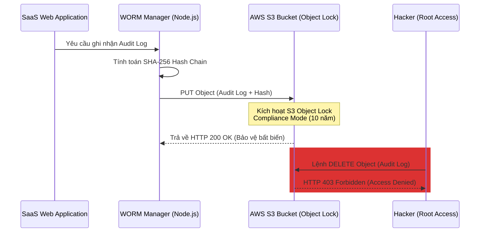

# Phụ lục Đồ án: Kiến trúc AWS S3 Object Lock cho WORM Audit Vault
*Tài liệu nghiên cứu giải pháp lưu trữ bất biến trên đám mây*
*Đề tài: Secure Multi-tenant SaaS Platform*

---

Trong môi trường điện toán đám mây (Cloud Production), việc lưu trữ ledger an ninh bất biến (WORM - Write Once, Read Many) cục bộ trên server Node.js có hạn chế về mặt mở rộng hạ tầng và rủi ro bị can thiệp nếu kẻ tấn công chiếm được quyền root của máy chủ ảo (VPS/EC2). Tài liệu này trình bày phương án kiến trúc hạ tầng sử dụng giải pháp **AWS S3 Object Lock** nhằm thực thi tính bất biến tuyệt đối chuẩn doanh nghiệp cho WORM Audit Vault.

---

## 1. Nguyên lý Hoạt động của AWS S3 Object Lock

AWS S3 Object Lock cho phép bạn lưu trữ các đối tượng bằng mô hình WORM. Giải pháp này ngăn chặn việc xóa hoặc ghi đè đối tượng trong một khoảng thời gian giữ lại (Retention Period) được xác định trước hoặc vô thời hạn (Legal Hold).



### Chế độ Bảo vệ Object Lock được chọn:
* **Compliance Mode (Chế độ Tuân thủ):** 
  * Trong chế độ này, đối tượng không thể bị xóa hoặc ghi đè bởi bất kỳ người dùng nào, kể cả tài khoản root của AWS (AWS Root Account).
  * Khoảng thời gian bảo lưu (Retention Period) không thể bị rút ngắn hoặc vô hiệu hóa. Đây là chế độ cao nhất để đáp ứng các tiêu chuẩn tài chính và an ninh khắt khe (SEC Rule 17a-4, FINRA, ISO 27001).

---

## 2. Mã nguồn Triển khai SDK Node.js (AWS SDK v3)

Dưới đây là module Node.js thực tế kết nối và đẩy ledger log bất biến lên AWS S3 sử dụng SDK v3:

```typescript
import { S3Client, PutObjectCommand, GetObjectCommand } from "@aws-sdk/client-s3";
import crypto from 'crypto';

const s3Client = new S3Client({
    region: process.env.AWS_REGION || "ap-southeast-1",
    credentials: {
        accessKeyId: process.env.AWS_ACCESS_KEY_ID!,
        secretAccessKey: process.env.AWS_SECRET_ACCESS_KEY!
    }
});

const BUCKET_NAME = process.env.AWS_S3_WORM_BUCKET_NAME!;

export interface AuditPayload {
    tenantId: string;
    userId: string;
    action: string;
    tableName: string;
    details: any;
    clientIp: string;
}

/**
 * Đẩy log bất biến lên AWS S3 Bucket có kích hoạt Object Lock
 */
export async function writeImmutableLogToS3(payload: AuditPayload, previousHash: string) {
    const timestamp = new Date().toISOString();
    
    // 1. Tính toán Hash Chain bảo vệ tính toàn vẹn
    const recordString = JSON.stringify(payload) + timestamp + previousHash;
    const currentHash = crypto.createHash('sha256').update(recordString).digest('hex');

    const ledgerEntry = {
        ...payload,
        timestamp,
        previous_hash: previousHash,
        current_hash: currentHash
    };

    const key = `ledger/${payload.tenantId}/${timestamp}_${currentHash.substring(0, 8)}.json`;

    // 2. Thiết lập Command gửi lên S3 với các Metadata Object Lock
    const command = new PutObjectCommand({
        Bucket: BUCKET_NAME,
        Key: key,
        Body: JSON.stringify(ledgerEntry),
        ContentType: "application/json",
        // Bắt buộc cấu hình Content-MD5 để AWS xác thực tính chính xác của file truyền lên
        ContentMD5: crypto.createHash('md5').update(JSON.stringify(ledgerEntry)).digest('base64'),
    });

    try {
        const response = await s3Client.send(command);
        console.log(`[AWS WORM] Log written successfully to S3: ${key}`);
        return {
            key,
            currentHash,
            s3VersionId: response.VersionId
        };
    } catch (error) {
        console.error("[AWS WORM Error] Failed to write immutable log:", error);
        throw error;
    }
}
```

---

## 3. Cấu hình Terraform (Infrastructure as Code)

Để đảm bảo S3 Bucket được kích hoạt Object Lock đúng chuẩn ở tầng hạ tầng, đây là đoạn mã Terraform mẫu cấu hình AWS resources:

```hcl
resource "aws_s3_bucket" "worm_audit_bucket" {
  bucket = "saas-secure-worm-audit-vault"

  # Bắt buộc kích hoạt Object Lock
  object_lock_enabled = true
}

resource "aws_s3_bucket_versioning" "worm_versioning" {
  bucket = aws_s3_bucket.worm_audit_bucket.id
  versioning_configuration {
    status = "Enabled"
  }
}

resource "aws_s3_bucket_object_lock_configuration" "worm_lock_config" {
  bucket = aws_s3_bucket.worm_audit_bucket.id

  rule {
    default_retention {
      mode = "COMPLIANCE"
      days = 3650 # Bảo lưu bất biến trong 10 năm
    }
  }
}
```

---
*Kiến trúc này nâng tầm đồ án tốt nghiệp từ mô hình thử nghiệm cục bộ thành một giải pháp an ninh hạ tầng đám mây thực chiến đạt tiêu chuẩn kiểm toán quốc tế.*
