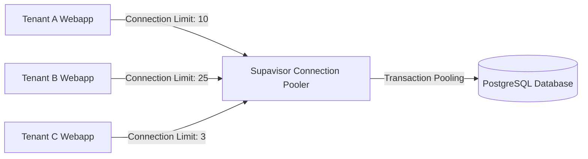

# Phụ lục Đồ án: Cấu hình Giới hạn Kết nối ở Tầng Cơ sở Dữ liệu qua Supavisor
*Tài liệu nghiên cứu an ninh và tối ưu hóa tài nguyên cơ sở dữ liệu*
*Đề tài: Secure Multi-tenant SaaS Platform*

---

Trong mô hình multi-tenant SaaS, nguy cơ một tenant thực hiện quá nhiều truy vấn đồng thời hoặc bị tấn công DDoS nội bộ làm cạn kiệt Connection Pool của database (Noisy Neighbor Attack) là một rủi ro cực kỳ lớn. Ngoài việc giới hạn ở tầng ứng dụng (Tenant Pooler Widget), chúng ta cần cấu hình chốt chặn cuối cùng ở tầng cơ sở dữ liệu thông qua **Supavisor** (Bộ kết nối trung gian của Supabase). Tài liệu này hướng dẫn cách thức thiết lập và enforce các tham số giới hạn này.

---

## 1. Nguyên lý Hoạt động của Supavisor Connection Pooler

Supavisor hoạt động như một Proxy đứng trước PostgreSQL để quản lý và tái sử dụng các kết nối cơ sở dữ liệu. Nó cung cấp hai chế độ pooling quan trọng:
* **Session Mode:** Mỗi kết nối của client giữ một kết nối Postgres thực tế cho đến khi client ngắt kết nối.
* **Transaction Mode (Được khuyên dùng):** Một kết nối Postgres chỉ được gán cho client trong thời gian diễn ra transaction. Sau đó, kết nối Postgres lập tức được trả về pool để phục vụ các truy vấn khác. Điều này giúp hệ thống hỗ trợ hàng chục ngàn kết nối đồng thời với lượng RAM DB tối thiểu.



---

## 2. Cấu hình Connection Limit theo Tenant trong Supavisor

Supavisor cho phép phân chia connection limit động theo từng chuỗi kết nối của Tenant (Database Users). Để thiết lập điều này, chúng ta định cấu hình các tham số giới hạn kết nối ở cơ sở dữ liệu Supabase:

### Bước 1: Phân bổ Database Role động cho Tenant
Mỗi Tenant khi onboard sẽ được gán một Database Role tương ứng (Ví dụ: `tenant_role_55555555`). Điều này đảm bảo Database-level isolation và phân vùng kết nối.

### Bước 2: Thiết lập giới hạn bằng lệnh SQL trên Postgres (Supavisor configuration)
Chúng ta có thể chạy các câu lệnh cấu hình trực tiếp trên database để giới hạn connection của từng Database User/Tenant Role:

```sql
-- 1. Giới hạn số lượng kết nối tối đa của Tenant Free xuống 3 kết nối
ALTER ROLE tenant_role_free CONNECTION LIMIT 3;

-- 2. Giới hạn số lượng kết nối của Tenant Pro lên 10 kết nối
ALTER ROLE tenant_role_pro CONNECTION LIMIT 10;

-- 3. Giới hạn số lượng kết nối của Tenant Enterprise lên 25 kết nối
ALTER ROLE tenant_role_enterprise CONNECTION LIMIT 25;

-- Đọc lại cấu hình kết nối hiện tại để xác minh
SELECT rolname, rolconnlimit 
FROM pg_roles 
WHERE rolname LIKE 'tenant_role_%';
```

---

## 3. Quản lý Pooler Parameters qua cấu hình Docker (Self-Hosted Supabase)

Nếu vận hành hệ thống Self-Hosted Supabase, cấu hình Supavisor được thiết lập thông qua tệp cấu hình `docker-compose.yml` hoặc `supavisor.conf`:

```yaml
services:
  supavisor:
    image: supabase/supavisor:latest
    ports:
      - "5432:5432" # Cổng kết nối Transaction Mode
      - "6543:6543" # Cổng kết nối Session Mode
    environment:
      # Tổng kết nối Postgres thực tế tối đa được phép mở
      - DATABASE_POOL_SIZE=100
      # Chế độ mặc định (transaction)
      - DEFAULT_POOL_TYPE=transaction
      # Thời gian chờ tối đa khi pool hết slot kết nối (ms)
      - CLIENT_LOGIN_TIMEOUT=5000
      # Enforce strict limits
      - ENFORCE_ROLE_CONNECTION_LIMITS=true
```

---

## 4. Cơ chế Tự động Ngắt kết nối Treo (Pruning Idle Connections)

Để đảm bảo hệ thống không bị cạn kiệt kết nối do các client "treo" kết nối nhàn rỗi, ta thiết lập trigger dọn dẹp idle connections tự động ở PostgreSQL:

```sql
-- Thiết lập thời gian tối đa một transaction có thể chạy nhàn rỗi trước khi bị ngắt (5 phút)
ALTER SYSTEM SET idle_in_transaction_session_timeout = 300000;

-- Thiết lập thời gian tối đa một session kết nối rác treo (10 phút)
ALTER SYSTEM SET idle_session_timeout = 600000;

-- Áp dụng thay đổi cấu hình mà không cần restart database
SELECT pg_reload_conf();
```

---
*Việc cấu hình đồng bộ 2 tầng: Tầng ứng dụng (Tenant Connection Pooler) và Tầng cơ sở dữ liệu (Supavisor Role Limit) giúp hệ thống SaaS đạt mức độ phòng thủ chiều sâu (Defense-in-depth), sẵn sàng chịu tải lớn trong môi trường thực tế.*
