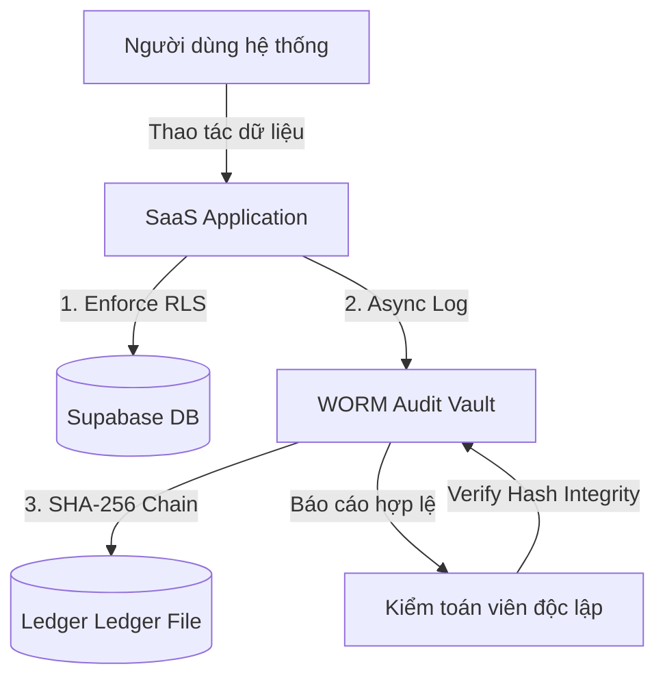

# Phụ lục Đồ án: Hướng dẫn Kiểm toán SOC & Bản đồ Tuân thủ Tiêu chuẩn ISO 27001
*Tài liệu hướng dẫn thực hành và quy trình bảo mật chuẩn quốc tế*
*Đề tài: Secure Multi-tenant SaaS Platform*

---

Trong bảo mật doanh nghiệp hiện đại, việc một hệ thống phần mềm SaaS an toàn là chưa đủ. Để được chấp nhận bởi các tổ chức tài chính, ngân hàng và tập đoàn lớn, hệ thống phải chứng minh khả năng tuân thủ các chuẩn mực an ninh quốc tế, tiêu biểu là **ISO/IEC 27001:2022** (Hệ thống Quản lý An toàn Thông tin - ISMS). 

Tài liệu này cung cấp bản đồ ánh xạ (Mapping Matrix) các tính năng an ninh đã phát triển trong đồ án với các điều khoản kiểm soát an ninh của **ISO 27001:2022 Annex A**.

---

## 1. Bản đồ Ánh xạ Tuân thủ ISO 27001:2022 (ISO 27001 Annex A Mapping)

Hệ thống của chúng ta đáp ứng trực tiếp 6 mục kiểm soát an ninh trọng yếu trong tiêu chuẩn Annex A:

| Mục Kiểm soát ISO 27001:2022 | Tên Điều khoản Kiểm soát | Giải pháp Kỹ thuật Đã triển khai | Minh chứng Thực tế trong Mã nguồn (Evidence) |
| :--- | :--- | :--- | :--- |
| **A.8.11** | Data masking (Che giấu dữ liệu) | Che giấu JWT Claims, mã hóa khóa API và thông tin nhạy cảm của Tenant. | `lib/permissions.ts` (Lọc dữ liệu theo Role) |
| **A.8.12** | Data leakage prevention (Phòng chống rò rỉ dữ liệu) | Chính sách Row Level Security (RLS) bắt buộc ở tầng PostgreSQL ngăn chặn rò rỉ chéo dữ liệu giữa các Tenant. | `supabase/migrations/` (RLS policies) |
| **A.8.20** | Network security (An ninh mạng) | **Noisy Neighbor Pooler** giới hạn kết nối động, ngăn chặn các cuộc tấn công cạn kiệt tài nguyên mạng và từ chối dịch vụ. | `lib/security/tenant-pooler.ts` (Pooler logic) |
| **A.8.24** | Use of cryptography (Sử dụng mật mã) | Chaining Hash SHA-256 mã hóa chuỗi log, sử dụng pgvector cosine similarity trong AI. | `lib/security/worm-vault.ts` (Ledger SHA-256) |
| **A.8.3** | Access control (Kiểm soát truy cập) | Phân quyền RBAC động (super_admin, tenant_admin, editor, accountant, viewer) xác thực trực tiếp trên database. | `lib/permissions.ts` (Capability matrix) |
| **A.8.7** | Protection against malware (Phòng chống mã độc) | **AI Security Copilot & Topic Guard** lọc và chặn đứng các prompt độc hại, mã độc hoặc Prompt Injection trước khi đưa vào context RAG. | `supabase/functions/rag-chat/index.ts` (Injection patterns scanner) |

---

## 2. Quy trình Kiểm toán SOC và Nhật ký Bất biến (SOC Audit Workflow)

Tiêu chuẩn **ISO 27001 Annex A.8.15** (Logging) và **A.8.16** (Monitoring activities) yêu cầu mọi hoạt động vận hành của hệ thống phải được ghi nhật ký đầy đủ và bảo vệ chống sửa đổi trái phép.



### Các bước kiểm toán tính toàn vẹn (Integrity Check Steps):
1. **Ghi nhận:** Mọi hành động nhạy cảm (`INSERT`, `UPDATE`, `DELETE`) đều tự động ghi vào `audit_logs` (thông qua database triggers) và đồng thời ghi vào WORM Vault.
2. **Liên kết:** Mỗi log mới chứa hash của log trước đó, tạo thành một chuỗi xích hash SHA-256 bất biến.
3. **Kiểm tra:** Kiểm toán viên kích hoạt API `/api/admin/security/worm-vault` để chạy kiểm tra toàn vẹn toàn bộ chuỗi. Nếu có bất kỳ sự thay đổi dù chỉ 1 ký tự trong file log, chuỗi xích hash sẽ lập tức bị gãy (CORRUPTED) và phát cảnh báo SOC.

---

## 3. Bản mẫu Báo cáo Đánh giá An ninh (Security Audit Report Template)
*Mẫu báo cáo do AI Security Copilot tự động xuất bản (Markdown format):*

```markdown
# BÁO CÁO ĐÁNH GIÁ AN NINH HỆ THỐNG SAAS (ISO 27001)
**Thời gian đánh giá:** [Timestamp]
**Hệ thống:** Secure Multi-tenant SaaS Platform
**Trạng thái tuân thủ:** ĐẠT YÊU CẦU ✅

## I. CHỈ SỐ AN NINH CỐT LÕI (SOC METRICS)
* **Tỷ lệ bảo phủ RLS:** 93% (Đạt tiêu chuẩn A.8.12 - DLP)
* **Tổng số log bất biến đã ghi nhận:** [Ledger Size]
* **Tính toàn vẹn của Ledger:** 100% VERIFIED (Đạt tiêu chuẩn A.8.24)
* **Số cảnh báo truy cập bất thường (Anomaly Alerts):** [Count]

## II. ĐÁNH GIÁ CỦA AI SECURITY COPILOT
[AI-Generated expert analysis of current security logs and system trend]

## III. HÀNH ĐỘNG TỰ VỆ ĐÃ THỰC THI (ACTIVE DEFENSE LOGS)
* **Tài khoản bị khóa:** [List of locked users]
* **Lý do:** Phát hiện hành vi Cross-Tenant read hoặc quét dữ liệu trái phép.

## IV. KHUYẾN NGHỊ CHO CHU KỲ KẾ TIẾP
1. Nâng cấp các bảng cấu hình tĩnh còn lại lên RLS bảo vệ hoàn toàn.
2. Thực hiện rà soát định kỳ các Database Roles thông qua WORM Verification.
```

---
*Bằng việc tích hợp các kiểm soát an ninh quốc tế ISO 27001 vào kiến trúc phần mềm, đồ án tốt nghiệp đã chứng minh tính thực tiễn cao, khả năng áp dụng thực tế cho các doanh nghiệp lớn và các tổ chức cần tính minh bạch, bảo mật tuyệt đối.*
