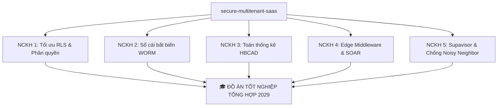

# 🎓 CHIẾN LƯỢC PHÂN TÁCH & ĐỀ CƯƠNG 5 ĐỀ TÀI NGHIÊN CỨU KHOA HỌC (NCKH)
> **Đồ án gốc:** Secure Multi-tenant SaaS (`secure-multitenant-saas`)  
> **Tác giả:** Chăm Rốch Thi (PTIT)  
> **Lộ trình chiến lược:** 2026 - 2029 (Bảo vệ đồ án tốt nghiệp tổng hợp)

---

## 🎯 TỔNG QUAN CHIẾN LƯỢC: "CHIA ĐỂ TRỊ" (2026 - 2029)
Thay vì nộp một đồ án duy nhất vào năm 2029 dưới dạng một hệ thống ứng dụng Web thông thường, việc chia nhỏ cấu trúc đồ án thành **5 đề tài Nghiên cứu Khoa học (NCKH)** độc lập giúp bạn:
1. **Tích lũy thành tích học thuật liên tục:** Gửi đăng các bài báo trên các kỷ yếu Hội nghị Khoa học (ví dụ: Hội nghị Quốc gia về CNTT - VJC, các tạp chí KHCN của các trường Đại học), tham gia giải Eureka, NCKH cấp Trường/cấp Bộ.
2. **Xây dựng uy tín khoa học:** Khi bảo vệ đồ án năm 2029, bạn có thể khẳng định từng phân hệ của đồ án đều đã được phản biện khoa học độc lập và công bố thành công.
3. **Giảm áp lực thực thi:** Tập trung củng cố toán học, thực nghiệm và lý thuyết cho từng phân hệ qua mỗi năm.

---

## 📚 CHI TIẾT 5 ĐỀ TÀI NGHIÊN CỨU KHOA HỌC CỐT LÕI

---

### 🛢️ NCKH 1: Tối ưu hóa hiệu năng cơ sở dữ liệu và Cơ chế phân quyền
*   **Tên đề tài:** *"Đánh giá hiệu năng và độ trễ của kiến trúc phân quyền Zero Trust đa khách hàng dựa trên PostgreSQL Row-Level Security và giải pháp tối ưu hóa in-memory JWT Claims"*
*   **Mục tiêu nghiên cứu:** Giải quyết bài toán suy giảm hiệu năng nghiêm trọng (Performance Overhead) của cơ chế Row-Level Security truyền thống khi phải JOIN nhiều bảng ở quy mô dữ liệu lớn.
*   **Ánh xạ mã nguồn:** 
    *   Các tệp migration RLS Policies: Thư mục `supabase/migrations/`
    *   Trang đo đạc thực nghiệm: [performance/page.tsx](file:///e:/Projects/Project_TN/PTIT_THESIS_SAAS/app/admin/performance/page.tsx) và [scaling-engine.ts](file:///e:/Projects/Project_TN/PTIT_THESIS_SAAS/app/admin/performance/scaling-engine.ts)
    *   Trình giả lập Database: [server.ts](file:///e:/Projects/Project_TN/PTIT_THESIS_SAAS/lib/supabase/server.ts)
*   **Cơ sở lý thuyết & Công thức toán học:**
    *   **Độ phức tạp trích xuất Context:** Phương pháp JWT Claims trích xuất trực tiếp giá trị `tenant_id` từ Context Session RAM đạt **$O(1)$** thay vì phải thực hiện câu lệnh JOIN quét qua bảng `tenants` có độ phức tạp **$O(N)$** hoặc **$O(M \times N)$** tùy thuộc vào số lượng dòng của bảng liên kết.
    *   **Độ phức tạp truy vấn dữ liệu:** Tận dụng cấu trúc cây B-Tree Index trên trường `tenant_id` đưa độ phức tạp tìm kiếm phân khu dữ liệu về mức tối ưu **$O(\log N_{\text{tenant}})$** thay vì quét tuần tự **$O(N)$** (Sequential Scan).
*   **Kế hoạch thực nghiệm:**
    *   Đo lường độ trễ trung bình (AVG), P50, P95, P99 Latency khi tải dữ liệu tăng dần từ `1,000` $\rightarrow$ `10,000` $\rightarrow$ `100,000` bản ghi.
    *   Vẽ biểu đồ phân kỳ hiệu năng chứng minh giải pháp tối ưu hóa Claims giữ độ trễ ổn định ở mức hằng số khi quy mô phình to.

---

### 💾 NCKH 2: Mật mã học ứng dụng và Nhật ký kiểm toán bất biến
*   **Tên đề tài:** *"Ứng dụng hàm băm mật mã học liên kết chuỗi (SHA-256 Hash-chaining) trong việc xây dựng sổ cái kiểm toán bất biến (WORM Vault) đáp ứng tiêu chuẩn an toàn đám mây ISO/IEC 27017"*
*   **Mục tiêu nghiên cứu:** Thiết kế giải pháp ngăn chặn tuyệt đối hành vi sửa đổi hoặc xóa nhật ký kiểm toán (Audit Trail) từ những tài khoản có đặc quyền cao (Super Admin) hoặc khi cơ sở dữ liệu vật lý bị tấn công trực tiếp.
*   **Ánh xạ mã nguồn:** 
    *   Thư viện mật mã học chuỗi khối: [worm-vault.ts](file:///e:/Projects/Project_TN/PTIT_THESIS_SAAS/lib/security/worm-vault.ts)
    *   Bộ thẩm định pháp lý Forensic: [worm-vault-widget.tsx](file:///e:/Projects/Project_TN/PTIT_THESIS_SAAS/components/admin/worm-vault-widget.tsx)
    *   Trigger ngăn chặn DML: [20260522000001_immutable_audit_logs_and_abac_extension.sql](file:///e:/Projects/Project_TN/PTIT_THESIS_SAAS/supabase/migrations/20260522000001_immutable_audit_logs_and_abac_extension.sql)
*   **Cơ sở lý thuyết & Công thức toán học:**
    *   **Thuật toán chuỗi băm liên kết (Cryptographic Hash Chaining):**
        $$H_i = \text{SHA-256}(H_{i-1} \parallel \text{Payload}_i \parallel \text{Timestamp}_i)$$
        Trong đó:
        - $H_i$: Mã băm của bản ghi hiện tại.
        - $H_{i-1}$: Mã băm của bản ghi liền trước (khóa xích liên kết).
        - $\parallel$: Phép toán nối chuỗi (concatenation).
    *   **Cơ chế WORM (Write Once, Read Many):** Kết hợp Trigger chặn các lệnh `UPDATE` và `DELETE` ở tầng CSDL.
*   **Kế hoạch thực nghiệm:**
    *   Chạy thực nghiệm giả lập sửa đổi trực tiếp dữ liệu log trong PostgreSQL.
    *   Kiểm chứng khả năng phát hiện lỗi toàn vẹn của Forensic Chain Auditor, hiển thị chính xác vị trí dòng (Block Index) bị can thiệp và cô lập tức thời.

---

### 🧮 NCKH 3: Toán thống kê trong phát hiện bất thường an ninh
*   **Tên đề tài:** *"Phát triển động cơ phát hiện hành vi bất thường lai (HBCAD) thời gian thực sử dụng độ lệch chuẩn Z-Score và hình phạt chuỗi vi phạm (SPP) trong môi trường Multi-tenant"*
*   **Mục tiêu nghiên cứu:** Thay thế các ngưỡng chặn tĩnh thô sơ (Static Thresholds) bằng mô hình toán học thống kê động để phát hiện các tài khoản bị chiếm quyền dựa trên hành vi bất thường.
*   **Ánh xạ mã nguồn:**
    *   Động cơ HBCAD: [edge-defense.ts](file:///e:/Projects/Project_TN/PTIT_THESIS_SAAS/lib/security/edge-defense.ts) (phần tính toán rủi ro và CRS)
    *   Quy trình phản ứng tự động: [20260522000002_dynamic_telegram_alerts_and_auto_suspend.sql](file:///e:/Projects/Project_TN/PTIT_THESIS_SAAS/supabase/migrations/20260522000002_dynamic_telegram_alerts_and_auto_suspend.sql)
*   **Cơ sở lý thuyết & Công thức toán học:**
    *   **Công thức thống kê độ lệch chuẩn Z-Score:**
        $$Z = \frac{X - \mu}{\sigma}$$
        Trong đó:
        - $X$: Tần suất thao tác hiện tại của người dùng trong 1 giờ.
        - $\mu$: Giá trị trung bình lịch sử thao tác của người dùng đó.
        - $\sigma$: Độ lệch chuẩn lịch sử.
    *   **Chỉ số Rủi ro Tích lũy (Cumulative Risk Score - CRS):**
        $$\text{CRS} = w_{\text{abac}} \times R_{\text{abac}} + w_{\text{z}} \times Z + \sum_{k=1}^{n} \text{SPP}(k)$$
        Trong đó $\text{SPP}(k)$ là hình phạt lũy tiến cho chuỗi hành vi đáng ngờ liên tiếp (Sequential Penalty Penalty).
*   **Kế hoạch thực nghiệm:**
    *   Thu thập dữ liệu hành vi của 100 người dùng ảo để tạo baseline $\mu$ và $\sigma$.
    *   Giả lập hành vi tấn công (ví dụ quét dữ liệu hàng loạt) và đo lường độ nhạy (Precision/Recall) của động cơ HBCAD so với cơ chế chặn tĩnh.

---

### 🛡️ NCKH 4: An ninh mạng biên và Tự động hóa ứng phó sự cố (SOAR)
*   **Tên đề tài:** *"Kiến trúc phòng thủ chủ động phân tầng (Tiered Active Defense) và chống Reverse DDoS tại mạng biên sử dụng Next.js Edge Runtime và Dynamic Cache"*
*   **Mục tiêu nghiên cứu:** Thiết kế hệ thống mạng biên cực nhẹ có khả năng chặn đứng các cuộc tấn công DDoS ở tầng ứng dụng và tự động cô lập thực thể bị tấn công (User/Tenant) dưới 4ms.
*   **Ánh xạ mã nguồn:**
    *   Edge Router & IP Whitelisting: [middleware.ts](file:///e:/Projects/Project_TN/PTIT_THESIS_SAAS/middleware.ts)
    *   Hệ thống cảnh báo Telegram SOS: [telegram-report-service.ts](file:///e:/Projects/Project_TN/PTIT_THESIS_SAAS/lib/security/telegram-report-service.ts)
    *   Bẫy an ninh: [route.ts (Honeypot Decoy)](file:///e:/Projects/Project_TN/PTIT_THESIS_SAAS/app/api/security/honeypot-decoy/route.ts)
*   **Cơ sở lý thuyết & Công thức toán học:**
    *   **Mô hình Zero Trust Network Access (ZTNA) & PEP/PDP:** Chuyển dịch điểm thực thi chính sách (PEP) lên sát thiết bị người dùng nhất (Edge Runtime).
    *   **Nguyên lý Phản ứng Phân tầng (Tiered SOC Response):**
        $$\text{Action} = \begin{cases} 
        \text{Block IP tại Edge} & \text{nếu } \text{CRS} \ge 90 \text{ hoặc kích hoạt Honeypot} \\
        \text{Lockdown Tenant} & \text{nếu phát hiện tấn công phân tán trên Tenant} \\
        \text{Alert Admin via Webhook} & \text{với mọi cảnh báo vi phạm}
        \end{cases}$$
*   **Kế hoạch thực nghiệm:**
    *   Đo lường thời gian xử lý của Edge Middleware (cam kết $< 4\text{ms}$).
    *   Đo lường thời gian từ lúc cuộc tấn công bắt đầu đến lúc IP bị chặn cứng ở Edge và Telegram nhận cảnh báo đỏ (tính bằng mili-giây).

---

### 📊 NCKH 5: Cô lập tài nguyên cơ sở dữ liệu và Giải quyết Noisy Neighbor
*   **Tên đề tài:** *"Giải pháp cô lập tài nguyên phần cứng và chống cản trở tài nguyên chéo (Noisy Neighbor Protection) trong môi trường Multi-tenant dựa trên cơ chế cấu hình Supavisor Connection Limits ở tầng ứng dụng"*
*   **Mục tiêu nghiên cứu:** Giải quyết triệt để rủi ro cạn kiệt tài nguyên cơ sở dữ liệu (Database Starvation) khi một Tenant bị tấn công DDoS làm cạn kiệt Connection Pool của cả hệ thống.
*   **Ánh xạ mã nguồn:**
    *   Custom Client Connection: [server.ts](file:///e:/Projects/Project_TN/PTIT_THESIS_SAAS/lib/supabase/server.ts) (phần acquireSlot và releaseSlot)
    *   Động cơ quản lý giới hạn tài nguyên: [tenant-pooler.ts](file:///e:/Projects/Project_TN/PTIT_THESIS_SAAS/lib/security/tenant-pooler.ts)
    *   Threat Simulator kịch bản Noisy Neighbor: [simulate-attack/route.ts](file:///e:/Projects/Project_TN/PTIT_THESIS_SAAS/app/api/admin/security/simulate-attack/route.ts)
*   **Cơ sở lý thuyết & Công thức toán học:**
    *   **Kiến trúc Connection Pooling & Starvation Theory:** Hạn chế số lượng kết nối tối đa dựa trên Plan:
        $$\text{Connection Limit}_{\text{tenant}} = \begin{cases}
        3 & \text{nếu gói Free} \\
        10 & \text{nếu gói Pro} \\
        40 & \text{nếu gói Enterprise}
        \end{cases}$$
    *   **Thuật toán Semaphore điều tiết luồng ghi:** Giới hạn kết nối đồng thời động tại tầng ứng dụng trước khi chuyển tiếp yêu cầu đến PostgreSQL.
*   **Kế hoạch thực nghiệm:**
    *   Bắn đồng thời 8 kết nối vào Tenant gói Free (giới hạn 3).
    *   Chứng minh hệ thống chỉ cho phép 3 truy cập thành công, chặn đứng 5 truy cập còn lại bằng mã lỗi `HTTP 429` và lập tức tạo log kiểm toán an ninh `connection_exhaustion_attempt` để ghi nhận sự cố.

---

## 📅 LỘ TRÌNH THỰC HIỆN CHI TIẾT (2026 - 2029)

### 🔹 Giai đoạn 1: Năm thứ 2 (2026 - 2027)
*   **Nhiệm vụ trọng tâm:** Hoàn thành các công bố về **Hiệu năng RLS (NCKH 1)** và **Toán thống kê Z-Score (NCKH 3)**. Đây là hai đề tài có hàm lượng khoa học máy tính thuần túy cao nhất, dễ được các hội đồng duyệt NCKH thông qua.
*   **Hành động cụ thể:**
    1. Viết bài báo khoa học cho NCKH 1 dựa trên số liệu đo đạc 111,000 dòng tại trang Benchmark của dự án.
    2. Đăng ký đề tài NCKH cấp Khoa/Trường dựa trên thuật toán phát hiện bất thường của động cơ HBCAD.

### 🔹 Giai đoạn 2: Năm thứ 3 (2027 - 2028)
*   **Nhiệm vụ trọng tâm:** Hoàn thành các công bố về **Sổ cái WORM Vault (NCKH 2)** và **Kiến trúc Edge Security/SOAR (NCKH 4)**. Tập trung vào khía cạnh an toàn thông tin và ứng cứu sự cố thực tế.
*   **Hành động cụ thể:**
    1. Soạn thảo đề cương NCKH 2 đối chiếu sâu sắc với các control của tiêu chuẩn **ISO/IEC 27017 CLD.12.4.1**.
    2. Giả lập các kịch bản tấn công để thu thập số liệu phản ứng an ninh của Edge Middleware phục vụ bài báo NCKH 4.

### 🔹 Giai đoạn 3: Năm thứ 4 (2028 - 2029)
*   **Nhiệm vụ trọng tâm:** Hoàn thành nghiên cứu **Noisy Neighbor & Connection Limits (NCKH 5)** và thực hiện **Hợp nhất đồ án tốt nghiệp tổng hợp**.
*   **Hành động cụ thể:**
    1. Viết bài báo khoa học NCKH 5 phân tích sâu về bài toán cô lập tài nguyên phần cứng.
    2. Gom tất cả 5 mảnh ghép (đã có kết quả nghiệm thu NCKH hoặc bài báo công bố) thành 5 chương cốt lõi của cuốn báo cáo Đồ án Tốt nghiệp.
    3. Thiết kế bài thuyết trình demo 10 phút tự vận hành để thuyết phục tuyệt đối Hội đồng phản biện PTIT.

---

## 💡 KẾT LUẬN & ĐỀ XUẤT CHO TÁC GIẢ
Kiến trúc của dự án `secure-multitenant-saas` hiện trạng **rất giàu chất xám và có cấu trúc lý thuyết chặt chẽ**. Việc áp dụng lộ trình này không chỉ biến đồ án tốt nghiệp của bạn thành một công trình học thuật xuất sắc nhất khóa, mà còn mở ra cơ hội đạt các giải thưởng nghiên cứu khoa học lớn. 

> [!TIP]
> Bạn hãy lưu trữ tài liệu này trong thư mục `/docs` của mã nguồn để làm kim chỉ nam phát triển hệ thống trong suốt chặng đường sắp tới. Hệ thống mã nguồn và các bài test đã được cấu hình hoàn chỉnh để hỗ trợ bạn trích xuất số liệu thực nghiệm bất kỳ lúc nào!
