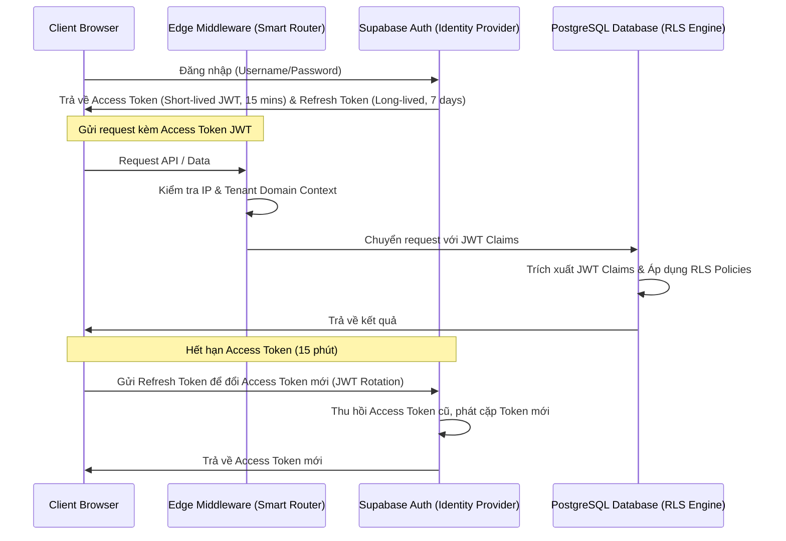

# JWT Rotation & Session Management (Quản lý phiên và Quay vòng khóa JWT)

## Mục tiêu
- Bảo vệ danh tính phiên truy cập của Tenant trên đám mây.
- Hạn chế nguy cơ tấn công replay attack hoặc sử dụng JWT bị lộ bằng cách luân chuyển khóa (Rotation) và giới hạn tuổi thọ session (Short-lived JWT).

## Kiến trúc Quản lý Phiên (Session Lifecycle)

## Các cơ chế chi tiết

### 1. Quay vòng JWT (JWT Rotation)
- Mỗi phiên đăng nhập được cấp một **Refresh Token** duy nhất.
- Khi Access Token hết hạn, client gọi dịch vụ auth để thực hiện tráo đổi Refresh Token lấy Access Token mới.
- Hệ thống áp dụng nguyên tắc **One-Time Use** cho Refresh Token: một khi Refresh Token đã được sử dụng để lấy Access Token mới, nó sẽ lập tức bị vô hiệu hóa. Nếu phát hiện một Refresh Token đã cũ được dùng lại, hệ thống sẽ coi đó là hành vi tấn công chiếm đoạt session, lập tức thu hồi toàn bộ các token liên đới của phiên đó.

### 2. Thời gian sống của Token (Token Lifetime)
- **Access Token**: Có tuổi thọ ngắn (15 phút), giảm thiểu thời gian kẻ tấn công có thể lợi dụng nếu token bị đánh cắp.
- **Refresh Token**: Có tuổi thọ dài (7 ngày) nhưng được mã hóa và lưu trữ an toàn dưới dạng HttpOnly Cookie ở phía Client để tránh các cuộc tấn công XSS.

### 3. Tích hợp RLS và Custom Claims
- Khi JWT được giải mã tại PostgreSQL, các custom claims của tenant (`tenant_id`, `role`, `user_metadata`) được load trực tiếp vào local memory session của connection transaction thông qua hàm `auth.jwt()`.
- RLS Policy sử dụng các biến này để thực thi cô lập dòng dữ liệu mà không cần gọi truy vấn JOIN sang bảng Users hay Tenants, tăng tốc độ xử lý lên mức hằng số $O(1)$.

---
*Tài liệu này đóng vai trò quan trọng trong việc làm rõ kiến trúc xác thực Zero Trust trong đồ án của sinh viên Chăm Rốch Thi.*
