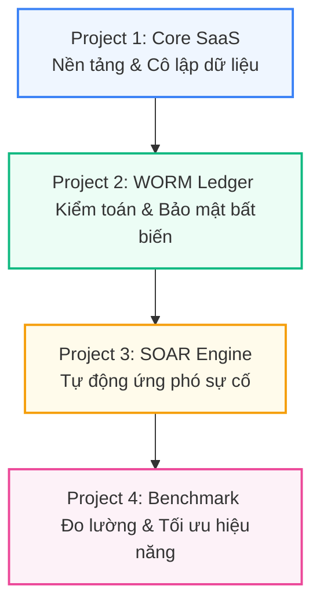

# HỒ SƠ ĐỊNH VỊ NĂNG LỰC & BẢN BẢN ĐỒ CHIA TÁCH DỰ ÁN CHO CV
> **Định hướng ứng tuyển:** Intern Software / System / Cloud Security Engineer (Dành riêng cho Sinh viên cuối năm 2)  
> **Chuyên ngành chính quy:** Kỹ thuật Phần mềm (Software Engineering - PTIT)  
> **Chiến lược cốt lõi:** Tận dụng thế mạnh Kỹ thuật Phần mềm để đi sâu vào Kiến trúc Hệ thống, Hệ thống Thông tin và An toàn Thông tin từ trong mã nguồn (Application Security / Security-by-Design).  

---

## PHẦN 1: CHIẾN LƯỢC ĐỊNH VỊ THƯƠNG HIỆU CÁ NHÂN (PERSONAL BRANDING)

Một sinh viên cuối năm 2 thường bị đóng khung vào các dự án học tập đơn giản (CRUD Apps, quản lý thư viện). Việc bạn sở hữu các phân hệ kiến trúc hạ tầng chuyên sâu là một lợi thế cạnh tranh cực lớn. Bạn cần định vị rõ ràng mình không phải là một "thợ gõ code" tính năng thông thường, mà là một **kỹ sư có tư duy thiết kế hệ thống vững chắc và an toàn ngay từ đầu**.

### 1.1 Tiêu đề chuyên môn trên CV (Job Title Target)
> **SOFTWARE ENGINEERING INTERN**  
> *Specializing in System Architecture & Application Security*

### 1.2 Đoạn giới thiệu bản thân (Professional Summary - Chuẩn ATS)
> "A Software Engineering student at PTIT (Sophomore) with a strong passion for **System Architecture, Database Engineering, and Application Security**. Specialize in designing secure-by-default software architectures, implementing robust database-level tenant isolation, and engineering event-driven security automation. Eager to leverage system thinking and hands-on experience in building tamper-resistant platforms for the **Software/Infrastructure/Security Engineering Intern** role."

---

## PHẦN 2: BẢN ĐỒ PHÂN RÃ 4 DỰ ÁN CON CHI TIẾT (CV PROJECTS SECTION)

Dưới đây là 4 dự án con được thiết kế theo lộ trình tiến cấp khoa học: **Đi từ nền tảng thiết kế CSDL đa người dùng $\rightarrow$ Gia cố bảo mật kiểm toán $\rightarrow$ Tự động hóa vận hành bảo mật $\rightarrow$ Đo lường thực nghiệm và tối ưu hóa**.

---

### PROJECT 1: Multi-Tenant SaaS Core Platform & Access Control
*Dự án nền tảng chứng minh năng lực thiết kế cơ sở dữ liệu quan hệ sạch sẽ, phân tách dữ liệu và thiết lập cơ chế phân quyền hệ thống.*

*   **Role:** System & Database Infrastructure Designer
*   **Core Technologies:** PostgreSQL, Next.js Middleware, Edge Runtime, Supabase Auth, JWT Custom Claims, B-Tree Indexing.
*   **Mã nguồn ánh xạ:** [middleware.ts](file:///e:/PTIT_THESIS_SAAS/middleware.ts) | [init_temple.sql](file:///e:/PTIT_THESIS_SAAS/init_temple.sql) | [schema.sql](file:///e:/PTIT_THESIS_SAAS/schema.sql)
*   **ATS-Optimized Bullet Points (Google XYZ Formula):**
    *   **Designed and engineered** a funnel-based **Defense-in-Depth** security model protecting a shared-database multi-tenant platform against cross-tenant data leakage and unauthorized access.
    *   **Enforced strict data isolation** at the database layer using **PostgreSQL Row-Level Security (RLS)**, achieving **$O(1)$ context resolution** by extracting tenant metadata directly from in-memory, cryptographically signed JWT Custom Claims.
    *   **Optimized query performance** to **$O(\log N_{\text{tenant}})$** complexity by implementing strategic B-Tree indexes on partitioning columns, verified through database execution plan analysis (`EXPLAIN ANALYZE`).
    *   **Implemented an Edge-level Smart Router** inside Next.js Middleware running at Edge Runtime with sub-4ms latency and dynamic IP Whitelisting to enforce intranet lockdown for administrative sections.

---

### PROJECT 2: Immutable Audit Logging System (WORM Architecture)
*Dự án nâng cao thể hiện tư duy bảo mật sâu sắc, biết viết triggers/functions phức tạp và áp dụng mật mã học vào bài toán chống chối bỏ.*

*   **Role:** Database Security Engineer
*   **Core Technologies:** PostgreSQL Triggers, SHA-256 Hashing, Cryptographic Hash-chaining, ISO/IEC 27017 Compliance.
*   **Mã nguồn ánh xạ:** [worm-vault.ts](file:///e:/PTIT_THESIS_SAAS/lib/security/worm-vault.ts) | Triggers in `init_temple.sql`
*   **ATS-Optimized Bullet Points (Google XYZ Formula):**
    *   **Architected and implemented** a tamper-proof audit trail adhering to **ISO/IEC 27017 CLD.12.4.1** cloud security standards, guaranteeing non-repudiation of administrative actions.
    *   **Prevented insider threats and unauthorized modifications** by writing strict PostgreSQL triggers that block $100\%$ of `UPDATE` and `DELETE` queries on the audit ledger, rendering the database physically immutable even to Super Administrators.
    *   **Developed a cryptographic SHA-256 hash-chaining ledger** where each transaction entry is mathematically linked to the preceding block's hash, enabling automatic tamper detection and verification.
    *   **Designed a cross-platform synchronization engine** that mirrors cryptographic logs to a secure, write-only cloud bucket to guarantee physical ledger integrity in case of complete system compromise.

---

### PROJECT 3: Security Operations & SOAR Automation Engine
*Dự án chuyên sâu chứng minh năng lực thiết kế hệ thống hướng sự kiện, tự động hóa phản phó sự cố (Incident Response) ở quy mô thực tế.*

*   **Role:** SecOps / Security Automation Engineer
*   **Core Technologies:** Database Triggers, Dynamic Threat Containment, pg_net, Asynchronous Webhooks, Telegram API.
*   **Mã nguồn ánh xạ:** [20260522000002_dynamic_telegram_alerts_and_auto_suspend.sql](file:///e:/PTIT_THESIS_SAAS/supabase/migrations/20260522000002_dynamic_telegram_alerts_and_auto_suspend.sql)
*   **ATS-Optimized Bullet Points (Google XYZ Formula):**
    *   **Designed and programmed** a lightweight, event-driven **SOAR (Security Orchestration, Automation, and Response)** framework embedded directly in the PostgreSQL engine.
    *   **Mitigated active threat propagation** by implementing an automated **Anomaly Containment trigger** that immediately suspends tenant accounts upon detecting $\ge 3$ RLS authorization violations within 60 seconds.
    *   **Engineered an asynchronous alerting pipeline** utilizing **`pg_net` HTTP POST** triggers, dispatching real-time, detailed attack payloads (violator IP, payload data, and timestamp) directly to the Security Operations Center (SOC) Telegram channel.
    *   **Minimized runtime performance overhead** on the database transaction pipeline by offloading all outbound webhook network calls to background asynchronous queues.

---

### PROJECT 4: Database Performance Benchmarking & Optimization
*Dự án thực nghiệm khoa học chứng minh tư duy định lượng, năng lực phân tích hiệu năng và tối ưu hóa hệ thống ở quy mô lớn.*

*   **Role:** Database Performance & Optimization Analyst
*   **Core Technologies:** EXPLAIN (ANALYZE, BUFFERS), Performance Profiling, Scale Testing, Synthetic Data Generation.
*   **Mã nguồn ánh xạ:** [scaling-engine.ts](file:///e:/PTIT_THESIS_SAAS/app/admin/performance/scaling-engine.ts) | [performance/page.tsx](file:///e:/PTIT_THESIS_SAAS/app/admin/performance/page.tsx)
*   **ATS-Optimized Bullet Points (Google XYZ Formula):**
    *   **Designed a scale testing harness** managing a synthetic enterprise database of **111,000 operational records** to evaluate security-performance trade-offs on cloud infrastructures.
    *   **Conducted controlled experiments** comparing three isolation baselines (App-side filtering, RLS JOINs, and Optimized JWT Claims) under both Cold Read (SSD) and Hot Read (Shared Buffers) cache states.
    *   **Proven mathematically** that RLS using JWT claims limits computational complexity to **$O(\log N_{\text{tenant}})$** via B-Tree Index Scan, maintaining flat latency profiles (1.1ms - 3.5ms) even as dataset scaled to 100k+ rows.
    *   **Conducted deep query diagnostics** using PostgreSQL **`EXPLAIN (ANALYZE, BUFFERS)`** to audit query plans, ensuring the query optimizer utilizes index scans instead of sequential scans during high-stress simulations.

---

## PHẦN 3: CẨM NANG PHỎNG VẤN KỸ THUẬT (MOCK INTERVIEW BLUEPRINT)

Dưới đây là các câu hỏi tình huống và cách trả lời thông minh để bạn lái thế mạnh từ "viết code giải thuật" sang "thiết kế kiến trúc hệ thống và bảo mật từ gốc".

### 💬 Câu hỏi 1: "Tại sao bạn học chuyên ngành Kỹ thuật Phần mềm nhưng các dự án trong CV lại tập trung rất sâu vào Hệ thống và ATTT?"
*   **Kịch bản trả lời thuyết phục:**
    > *"Thưa anh/chị, em nhận thấy đa số các kỹ sư mạng và bảo mật truyền thống thường chỉ thiết lập an ninh ở lớp vỏ ngoài hệ thống (như cấu hình tường lửa, mạng). Khi có lỗ hổng trong mã nguồn hoặc database, kẻ tấn công vẫn có thể bypass dễ dàng.*
    >
    > *Với nền tảng là sinh viên Kỹ thuật Phần mềm tại PTIT, em muốn tận dụng tư duy cấu trúc code để giải quyết bài toán bảo mật từ gốc, tức là **Application Security (AppSec) hay Security-by-Design**. Em tự học và lập trình các chính sách cô lập trực tiếp dưới tầng database, viết trigger mã hóa log và tự động ứng phó sự cố từ bên trong ứng dụng. Điều này giúp hệ thống an toàn và có tính chịu tải cao hơn nhiều so với việc chỉ đi vá lỗi phần mềm sau khi đã deploy."*

### 💬 Câu hỏi 2: "Khi dữ liệu của khách hàng tăng lên rất lớn, cơ chế Row-Level Security (RLS) hoạt động ở cấp độ dòng liệu có gây nghẽn hiệu năng (bottleneck) không? Bạn đã tối ưu hóa nó như thế nào?"
*   **Kịch bản trả lời thuyết phục:**
    > *"Nhận định này hoàn toàn chính xác nếu chúng ta thiết kế chính sách RLS theo cách truyền thống, tức là mỗi khi có yêu cầu truy cập, database phải thực hiện phép JOIN bảng người dùng để kiểm tra quyền hạn. Phép JOIN này có độ phức tạp tăng theo quy mô dữ liệu.*
    >
    > *Để giải quyết triệt để vấn đề này, em đã thực hiện tối ưu hóa qua 2 bước:*
    > *   *Một là, em đưa thông tin định danh `tenant_id` trực tiếp vào **JWT Custom Claims** khi người dùng đăng nhập. PostgreSQL RLS sẽ đọc trực tiếp metadata này từ bộ nhớ RAM Session (`auth.jwt()`) với chi phí hằng số **$O(1)$**, bypass hoàn toàn các phép JOIN bảng quyền hạn tốn kém.*
    > *   *Hai là, em đánh chỉ mục cứng **B-Tree Index** trên cột phân vùng `tenant_id`. Nhờ đó, PostgreSQL Query Planner không thực hiện Sequential Scan quét toàn bộ bảng mà nhảy thẳng đến vùng dữ liệu của Tenant đó với độ phức tạp **$O(\log N_{\text{tenant}})$**.*
    > *   *Em đã chứng minh điều này bằng thực nghiệm đo đạc **111,000 dòng dữ liệu thật** trên Supabase Cloud, kết quả đo bằng `EXPLAIN (ANALYZE, BUFFERS)` cho thấy latency duy trì ổn định ở mức phẳng từ 1.1ms đến 3.5ms."*

### 💬 Câu hỏi 3: "Nếu kẻ tấn công hack được quyền Super Admin cao nhất và cố tình xóa bảng `audit_logs` để xóa dấu vết phá hoại, hệ thống WORM của bạn ngăn chặn bằng cách nào?"
*   **Kịch bản trả lời thuyết phục:**
    > *"Trong hệ thống của em, quyền lực không nằm hoàn toàn ở tài khoản Admin ở tầng ứng dụng mà được bảo vệ bằng luật cứng cấp Database:*
    > *   *Đầu tiên, em viết triggers chặn toàn bộ các lệnh `UPDATE` và `DELETE` trên bảng `audit_logs`. Trigger này thực thi ở mức nhân CSDL, kể cả tài khoản Super Admin thực hiện câu lệnh cũng bị từ chối.*
    > *   *Thứ hai, để chống lại trường hợp kẻ tấn công can thiệp trực tiếp vào file dữ liệu thô trên ổ cứng của server CSDL, em thiết lập module **SHA-256 Hash-chaining**. Mỗi dòng log mới chèn vào bắt buộc phải băm liên kết với mã băm của dòng log trước đó.*
    > *   *Đồng thời, em có một cơ chế đồng bộ bất đồng bộ đẩy log ra ngoài một private cloud bucket có thuộc tính write-only. Nếu chuỗi băm trong DB bị đứt gãy hoặc không khớp với ledger bên ngoài, hệ thống sẽ phát hiện hành vi giả mạo và khóa hệ thống lập tức để cô lập nguy cơ."*

---

> [!TIP]
> **Hướng dẫn sử dụng tài liệu này:**
> 1. Lưu trữ file này làm tài liệu tham khảo cho quá trình ứng tuyển.
> 2. Sao chép trực tiếp các phần nội dung tiếng Anh chuẩn ATS vào CV cá nhân của bạn dưới định dạng PDF.
> 3. Hãy đọc kỹ phần cẩm nang phỏng vấn 3 lần trước khi tham gia các buổi phỏng vấn kỹ thuật để làm chủ cuộc hội thoại. Chúc bạn đạt kết quả thực tập xuất sắc tại các tập đoàn lớn! 🏆
