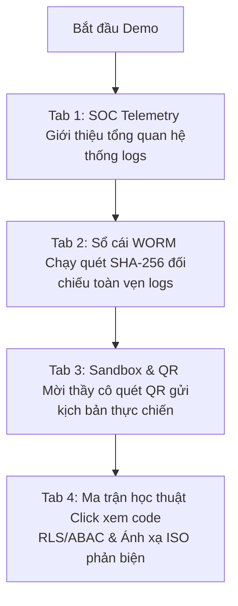

# Triết lý Thiết kế Giao diện Cyber SOC Dashboard (SOC UX Design Philosophy)

Tài liệu này ghi nhận toàn bộ các nguyên tắc thiết kế, cấu trúc lưới (Grid layout) và phân cấp thị giác (Visual Hierarchy) được áp dụng thực tế trên trang quản trị an ninh **Security Operations Center (SOC)**. Tài liệu đóng vai trò làm minh chứng khoa học về tối ưu hóa trải nghiệm người dùng (UX) trong các hệ thống giám sát an toàn thông tin chuyên dụng, phục vụ trực tiếp cho báo cáo và bảo vệ đồ án tốt nghiệp PTIT.

---

## 1. Nguyên tắc cốt lõi: Triệt tiêu sự chật chội & Quá tải thị giác (De-cluttering)

Trong các hệ thống giám sát an ninh doanh nghiệp, mật độ thông tin quá cao (Information Overload) thường gây bối rối cho kỹ sư SOC. Giải pháp của đề tài là áp dụng mô hình thiết kế **Phân vùng chức năng tối đa** thông qua 3 trụ cột:

### Trụ cột 1: Phân tách không gian bằng Premium Tabbed Interface
Thay vì xếp chồng toàn bộ các tính năng lên một trang cuộn dài vô tận, giao diện được chia thành **4 phân khu chuyên đề độc lập** thông qua thanh điều hướng Grid mượt mà:

| Phân khu (Tab) | Cấu trúc lưới (Layout Grid) | Vai trò UX & Cách biểu diễn |
|---|---|---|
| **Tab 1: Giám sát SOC thực tế** | Lưới bất đối xứng `1/3` (Trái) + `2/3` (Phải) | **Trái:** Hiển thị nhanh các thông tin trạng thái khẩn cấp (Cảnh báo Anomaly, danh sách IP Blocklist). **Phải:** Explorer log chi tiết có phân trang giúp dễ theo dõi hành vi hệ thống. |
| **Tab 2: Sổ cái WORM** | Khung tập trung `max-w-5xl mx-auto` | Cô lập hoàn toàn không gian xung quanh để kỹ sư SOC tập trung cao độ vào việc thẩm định mật mã học chuỗi khối SHA-256 chống tampering. |
| **Tab 3: Giả lập Sandbox** | Lưới cân bằng `1/2` (Trái) + `1/2` (Phải) | **Trái:** Bảng điều khiển giả lập tấn công (Threat Simulator) và Rate Limits. **Phải:** Widget Connection Pooler của Supavisor. Hỗ trợ so sánh trực quan tác động của tấn công lên tài nguyên kết nối. |
| **Tab 4: Ma trận học thuật** | Lưới cyberpunk `5/12` (Trái) + `7/12` (Phải) | **Trái:** 4 tầng bảo vệ Zero Trust xếp chồng dọc. **Phải:** Card Glassmorphic chi tiết hiển thị mã nguồn và ánh xạ ISO tương ứng. Cho phép click chọn nhanh chóng. |

---

### Trụ cột 2: Tiết giảm Clutter bằng bảng màu chuyên dụng (SecOps Palette)
Hệ thống loại bỏ hoàn toàn các dải màu gradient tím AI sáo rỗng hoặc thiết kế màu sắc lộn xộn:
* **Màu nền tối Unix-like:** Sử dụng gam màu tối làm chủ đạo (`slate-900`, `slate-950`) kết hợp với hiệu ứng làm mờ kính cường lực (Glassmorphism) tạo cảm giác chiều sâu không gian của một phòng vận hành SOC thực tế.
* **Mã hóa màu sắc theo độ nguy hại (Severity Colors):** Màu sắc được sử dụng làm thông điệp kỹ thuật thay vì mục đích trang trí:
  * **Xanh Emerald (`#10b981`):** Trạng thái an toàn, cô lập RLS thành công.
  * **Hổ phách (`#f59e0b`):** Trạng thái giám sát, định danh JWT Custom Claims.
  * **Xanh dương (`#3b82f6`):** Trạng thái kiểm toán, kiểm soát mạng biên Edge Security.
  * **Đỏ Rose (`#f43f5e`):** Trạng thái báo động đỏ, sập bẫy Honeypot hoặc vi phạm ABAC động.
* **Typography Monospace:** Các đoạn code thực thi, địa chỉ IP và điểm số rủi ro CRS được hiển thị bằng phông chữ monospace (`JetBrains Mono` / `Roboto Mono`) giúp tăng tốc độ đọc và nhận diện dữ liệu của kỹ sư vận hành.

---

### Trụ cột 3: Hoạt ảnh chuyển động mượt mà (Micro-animations)
* Chuyển tab được tích hợp hoạt ảnh Slide-in từ dưới lên mượt mà thông qua Tailwind CSS.
* **Bản Đồ Luồng Tấn Công SVG:** Sử dụng hoạt họa vector động chuyển động hạt để mô phỏng dòng dữ liệu chạy qua từng chốt chặn. Lớp bị chặn sẽ nhấp nháy viền LED đỏ neon tức thời, tạo hiệu ứng phản hồi trực quan sinh động và trực diện.

---

## 2. Kịch bản ứng dụng trình diễn trước Hội đồng tốt nghiệp PTIT

Bố cục giao diện này được tối ưu hóa đặc biệt giúp bạn hoàn toàn làm chủ thời gian và kịch bản demo:

1. **Bước 1 (Giới thiệu):** Mở **Tab 1** để trình bày bức tranh tổng quan về lưu lượng giám sát, cảnh báo rủi ro CRS thời gian thực của hệ thống đa tenant.
2. **Bước 2 (Chứng minh an toàn):** Mở **Tab 2**, bấm nút "Thẩm định sổ cái" để chứng minh khả năng tự phát hiện log bị xóa hoặc sửa đổi bằng thuật toán chuỗi khối.
3. **Bước 3 (Thực chiến Live Fire):** Mở **Tab 3**, chiếu mã QR động lên máy chiếu. Mời thầy cô quét QR bằng điện thoại và bấm tấn công. Cả hội trường sẽ quan sát chấm sáng di chuyển trên **Attack Flow Map**, nghe giọng nói tiếng Việt AI phát ra từ loa máy tính, nhìn thấy IP bị block lập tức trên bảng và điện thoại thầy cô hiện lỗi 403.
4. **Bước 4 (Phản biện):** Mở **Tab 4** khi thầy cô đặt câu hỏi về giải thuật cô lập dữ liệu. Bạn click chọn lớp bảo mật tương ứng để show ngay mã nguồn PostgreSQL RLS, JWT, trigger ABAC được thiết kế sạch sẽ ngay trên màn hình.

---
*Báo cáo Triết lý Thiết kế Giao diện SOC - Đồ án tốt nghiệp PTIT*
