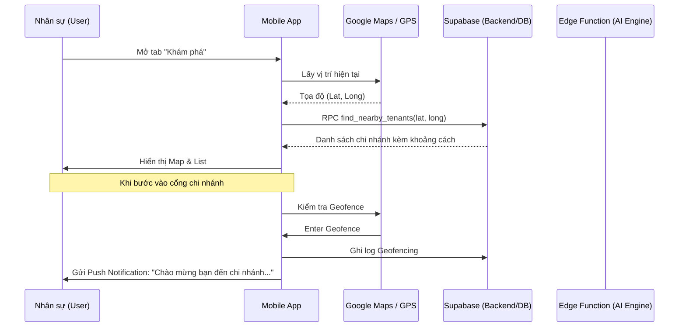

# Quy trình Hệ thống & Logic AI RAG (Dharma Chat 2.0)

Tài liệu này chi tiết hóa cách thức hoạt động của các tính năng "High-tech" trong hệ thống, tập trung vào trợ lý AI Dharma Chat và các cơ chế định vị.

---

## 1. Quy trình Người dùng (User Journey Workflow)

---

## 2. Quy trình AI Dharma Bot (RAG Pipeline 3.0)

Đây là tính năng cốt lõi, biến ứng dụng thành một người thầy số với khả năng ghi nhớ bối cảnh cuộc trò chuyện và bảo mật tài nguyên.

```mermaid
flowchart TD
    subgraph "Giai đoạn Nạp dữ liệu (Admin)"
        A1[Tài liệu PDF/Text] --> A2[Text Splitter - Chunks]
        A2 --> A3[Phân loại Danh mục]
        A3 --> A4[Embedding Model - Gemini]
        A4 --> A5[(pgvector DB)]
    end

    subgraph "Giai đoạn Truy vấn (Mobile App)"
        B1[Người dùng hỏi + sessionId] --> B1_0{Rate Limit?}
        B1_0 -- OK --> B1_1{Có Cache đã duyệt?}
        B1_0 -- Block --> B1_ERR[Lỗi 429: Thử lại sau 1 phút]
        
        B1_1 -- Có (High Priority) --> B7[Phản hồi từ Cache ⚡]
        B1_1 -- Không --> B2[Vectorize & Semantic Cache Scan]
        
        B2 -- Trùng khớp > 0.9 --> B7
        B2 -- Miss --> B3[RAG Retrieval]
        
        B3 --> B4[Trích xuất Metadata & Nguồn]
        B4 --> B5[Prompt: Research-Synthesize-Interpret]
        B5 --> B6[Gemini 2.0 Flash Lite]
        B6 --> B7
        
        B7 --> B8{Người dùng hài lòng?}
        B8 -- Không 👎 --> B9[Ghi log ai_low_quality_logs]
        B9 --> B10[Chuyên gia Học viện duyệt/sửa]
        B10 --> B11[Lưu AI Approved Cache]
        B11 -.-> B1_1
    end

    subgraph "Dọn dẹp & Bảo trì (Lean Optimizer)"
        C1[Giao dịch chat] --> C2{Xác suất 5%?}
        C2 -- Có --> C3[RPC optimize_db_space]
        C3 --> C4[Xóa Guest Logs > 24h]
        C3 --> C5[Xóa Rate Limits > 24h]
    end
```

### 2.1 Quy trình xử lý (Logic Flow 3.0 - Sản xuất)
Hệ thống áp dụng kiến trúc **Cost-Efficient RAG** với 4 lớp bảo vệ:

1.  **Lớp 1 - Rate Limiting (IP-based):** Chặn các hành vi spam/bot bằng cơ chế IP tracking (tối đa 5 câu/phút). Bảo vệ ngân sách API của dự án.
2.  **Lớp 2 - Semantic Cache (Bản sắc Chánh Pháp):** 
    - Ưu tiên các câu trả lời đã được Chuyên gia (Học viện Phật giáo) phê duyệt (`is_approved = true`).
    - Nếu không có, tìm kiếm các câu trả lời tương đồng > 90% đã từng được AI trả lời trước đó.
3.  **Lớp 3 - RAG Retrieval:** Nếu cache hụt, hệ thống mới bắt đầu Vector Search trong kho kinh điển `dharma_embeddings`.
4.  **Lớp 4 - HITL (Human-in-the-loop):** Mọi phản hồi AI đều có thể được chuyên gia xem lại và "nâng cấp" văn phong thủ công trong Dashboard quản trị.

### 2.2 Chính sách Lưu trữ "Lean Optimizer" (Tối ưu Supabase Free 500MB)
Để vận hành vĩnh viễn trên gói miễn phí, hệ thống áp dụng các quy chuẩn lưu trữ nghiêm ngặt:
- **Khách vãng lai (Guest):** 
    - Lịch sử chat lưu tại `localStorage` (trình duyệt người dùng). 
    - Server **không lưu** tin nhắn chi tiết của khách quá 24h.
- **Người dùng chính thức:** Lưu lịch sử đầy đủ trên server để đồng bộ đa thiết bị.
- **Tự động bảo trì:** Hệ thống có 5% cơ chế tự kích hoạt dọn dẹp dữ liệu cũ (Pruning) trên mỗi yêu cầu chat.

---

## 3. Quy trình Bóc tách Metadata Học thuật Tự động (Mới)

Để đảm bảo các đoạn trích dẫn (citations) của Dharma Chat luôn đi kèm với mã kinh và tên dịch giả chính xác mà không làm tốn thời gian của người quản trị, hệ thống đã tích hợp quy trình bóc tách tự động bằng AI.

### Luồng hoạt động:
1. **Kích hoạt**: Khi Admin nhấn nút **"Bắt đầu Vector hóa"** trong trang Nạp Kinh sách.
2. **Kiểm tra**: Hệ thống kiểm tra các trường Metadata (Mã Kinh, Bộ Kinh, Người dịch). Nếu để trống, bước AI Extraction sẽ được kích hoạt ngầm.
3. **Phân tích**:
    - Hệ thống lấy 8000 ký tự đầu tiên của file PDF (thường là trang bìa, lời giới thiệu hoặc trang bản quyền).
    - Gửi dữ liệu qua **Gemini 2.0 Flash Lite** với Prompt chuyên dụng để nhận diện cấu trúc học thuật Phật giáo.
4. **Hòa trộn (Merge)**: 
    - AI trả về JSON chứa các trường metadata.
    - Hệ thống ưu tiên dữ liệu Admin đã nhập thủ công. Nếu Admin bỏ trống, dữ liệu AI tìm được sẽ được điền vào.
5. **Đồng bộ hóa**: Toàn bộ các đoạn vector (embeddings) sau đó sẽ được lưu vào database kèm theo bộ metadata hoàn chỉnh này.

### Lợi ích:
- **Tiết kiệm thời gian**: Admin không cần tra cứu mã kinh hay tên nhà xuất bản cho mỗi file PDF.
- **Trích dẫn chuẩn xác**: Dharma Chat có đủ dữ liệu để trả lời dạng: *"Theo Sn 2.4, kệ 262, HT. Minh Châu dịch..."* thay vì chỉ trả lời chung chung.

---

## 4. Logic Geofencing & Push Notification

- **Mobile Side:** Sử dụng Geofencing để theo dõi ranh giới địa lý của chi nhánh.
- **Server Side:** Khi nhận sự kiện "Enter", hệ thống lấy lời chào (Welcome Message) từ cấu hình `site_settings` của chi nhánh đó và gửi thông báo qua Firebase Cloud Messaging (FCM).

---

## 4. Các tính năng mở rộng khác

- **AR (Số hóa di sản):** Nhận diện phù điêu/tượng để hiển thị thông tin ảo hoặc thuyết minh âm thanh.
- **Kinh điển số:** Tích hợp trình đọc kinh tối ưu cho di động với khả năng tra cứu thuật ngữ tức thì.
