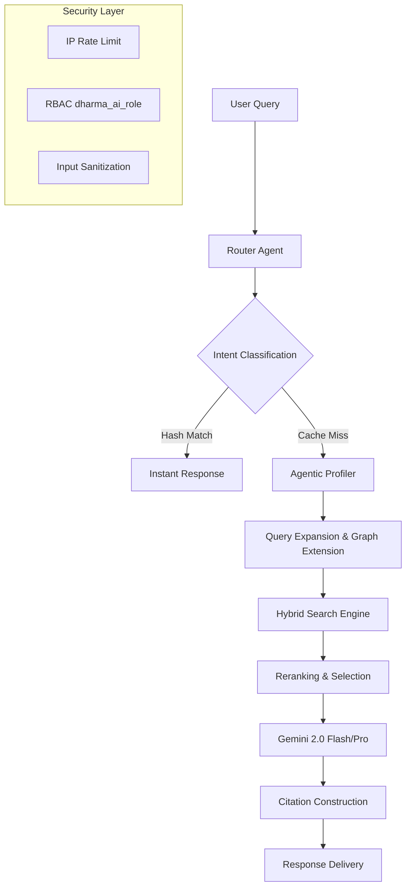

# White Paper: Kiến trúc Agentic GraphRAG trong Số hóa Tri thức Phật học

## Tóm tắt (Abstract)
Bản nghiên cứu này trình bày **Dharma GraphRAG Engine**, một hệ thống Retrieval-Augmented Generation (RAG) thế hệ mới được thiết kế chuyên biệt cho tri thức Phật học. Hệ thống kết hợp giữa **Agentic Workflow** (Tác tử tự trị), **Hybrid Search** (Tìm kiếm lai) và **Ontology Graph** (Đồ thị tri thức) để giải quyết các thách thức về ngôn ngữ cổ (Pali, Hán-Việt), ngữ cảnh đàm đạo phức tạp và yêu cầu độ chính xác học thuật tuyệt đối.

---

## 1. Thách thức trong RAG Phật học
1.  **Rào cản thuật ngữ:** Một khái niệm có thể xuất hiện dưới nhiều tên gọi khác nhau (Vd: *Tham ái* - *Lobha* - *Tan̄hā*).
2.  **Ngữ cảnh đa tầng:** Các câu trả lời Phật học thường đòi hỏi sự nhất quán theo hệ phái (Nam Tông, Bắc Tông, Khất Sĩ).
3.  **Sự "ảo giác" của AI (Hallucination):** LLM phổ thông thường trộn lẫn các quan niệm dân gian với kinh điển chính thống.

---

## 2. Kiến trúc Hệ thống đa lớp (Layered Architecture)

Hệ thống được vận hành trên **Supabase Edge Runtime (Deno)**, tích hợp luồng xử lý 5 giai đoạn:

### 2.1. Router Cache & Deterministic Classification
Hệ thống sử dụng cơ chế **SHA-256 Transaction Hashing** để lưu trữ kết quả phân loại ý định (classification). 
- **Lợi ích**: Giảm độ trễ trung bình xuống < 500ms cho các truy vấn tái lặp.
- **Tiết kiệm**: Giảm chi phí token cho bước định tuyến (routing) chiếm khoảng 15-20% tổng chi phí vận hành.

### 2.2. Thuật toán Vận hành Đồ thị (Graph Algorithmics)
Hệ thống không chỉ lưu trữ mà còn chủ động xử lý tri thức thông qua các thuật toán:
- **1-hop Neighborhood Traversal**: Từ một thực thể được nhận diện, hệ thống tự động mở rộng sang các nút lân cận trực tiếp. Điều này giúp AI nắm bắt được "ngữ cảnh tức thời" mà không gây bùng nổ tài nguyên (Graph Explosion).
- **Weight-based Relationship Selection**: Sử dụng trọng số (`weight`) để ưu tiên các liên kết giáo lý cốt lõi. Thuật toán chỉ chọn lọc `Top-K` quan hệ có trọng số cao nhất để đưa vào prompt.
- **Fuzzy Entity Mapping**: Kết hợp giữa nhúng vector và khớp chuỗi (String matching) để ánh xạ ngôn ngữ đời thường vào các chuẩn thuật ngữ học thuật trong đồ thị.

### 2.3. Security Hardening (Enterprise Grade)
Để đảm bảo tính toàn vẹn của dữ liệu học thuật, hệ thống áp dụng các lớp bảo mật đa tầng:
- **Project Restricted AI Role**: Sử dụng `dharma_ai_role` với quyền hạn tối thiểu (Principle of Least Privilege).
- **IP Protection**: Cơ chế chặn spam ở tầng Database (RPC), ngăn chặn tấn công từ chối dịch vụ (DoS).

---

## 3. Thông số Kỹ thuật (Technical Specifications)

| Thành phần | Công nghệ / Thông số | Ghi chú |
| :--- | :--- | :--- |
| **Embedding Model** | `gemini-embedding-2-preview` | 1536 Dimensions |
| **LLM Core** | Gemini 2.0 Flash Lite (Primary) / Llama 3 70B (Fallback) | Cơ chế Multi-provider Failover |
| **Vector Database** | pgvector on PostgreSQL | Distance Metric: Cosine Similarity |
| **Hybrid Search** | Vector (0.55) + BM25 (Full-text) | Giải quyết từ khóa chuyên môn Pali |
| **Router Cache** | SHA-256 Hashing | Non-blocking via `waitUntil` |
| **Security** | IP Rate Limit + RBAC | 15 req/min/IP |

---

## 4. Quy trình Hybrid Search (Tìm kiếm Lai)
Hệ thống kết hợp đồng thời hai cơ chế truy xuất:
1.  **Semantic Search:** Tìm kiếm theo ý nghĩa (Vector), nắm bắt được các câu hỏi mang tính gợi mở, cảm xúc.
2.  **Keyword Search (BM25):** Tìm kiếm chính xác từng ký tự cho các mã kinh (Vd: *Sn 2.4*, *DN 1*) hoặc tên riêng Pāli mà Embedding model chưa được fine-tune sâu.

---

## 5. Đánh giá Đề tài (Evaluation Metrics)
Hệ thống được định hướng đánh giá theo framework **Ragas**:
- **Faithfulness (Trung thực):** Đo lường tỉ lệ thông tin trong câu trả lời có thể suy luận trực tiếp từ Context (Kinh điển).
- **Answer Relevancy (Sát đề):** Đánh giá mức độ giải quyết trực tiếp nỗi trăn trở của người dùng.
- **Context Precision:** Đảm bảo các đoạn kinh dẫn chứng là thực sự cần thiết và chính xác cho câu hỏi đó.

---

## 6. Giá trị Học thuật & Thực tiễn
1.  **Bảo tồn số:** Hệ thống hóa tri thức Pali/Hán-Việt vào một bản đồ thực thể (Ontology).
2.  **Hỗ trợ Hoằng pháp:** Cung cấp công cụ tra cứu tức thời, có dẫn chứng nguồn gốc rõ ràng cho Tăng Ni, Nhân sự.
3.  **Tiên phong Công nghệ:** Ứng dụng những kiến trúc tiên tiến nhất (GraphRAG, Agentic Workflow) vào một lĩnh vực văn hóa truyền thống.

---
**Nhóm Nghiên cứu:** [Tên Dự án/Người thực hiện]  
**Phiên bản:** 2.1 (Production-Ready)  
**Ngày cập nhật:** 17/04/2026
